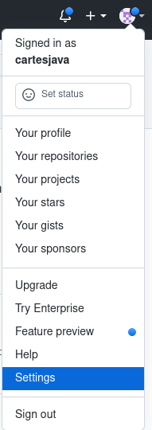
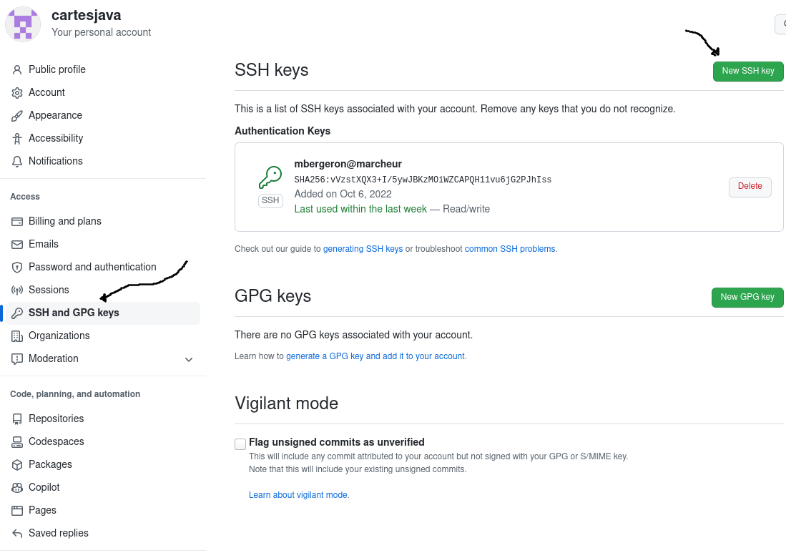
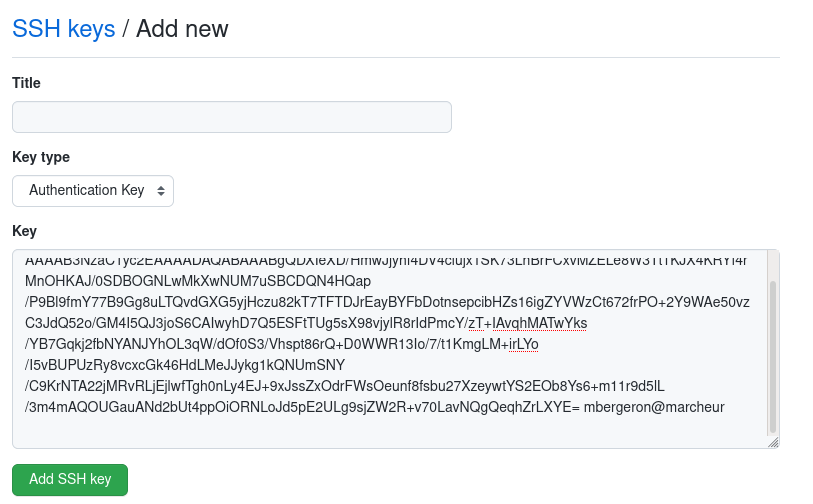
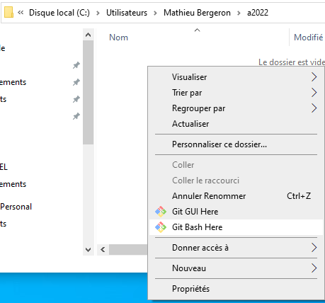

# Pour modifier ce site

## Pour les nouveaux contributeurs

1. Voir https://cartesjava.github.io/annexes/annexe_modifier_manuel/

## Pour les propriétaires de ce dépôt Git

### Préalables

1. Installer <a href="https://git-scm.com/downloads">Git</a>
1. Installer <a href="https://gohugo.io/installation">Hugo</a>

### Créer et ajouter sa clé USB

1. Ouvrir un GitBash et faire la commande suivante

    ```bash
    $ ssh-keygen
    ```

    * Appuyer sur <kbd>Entrée</kbd> pour choisir les options par défaut

1. Sur GitHub, ouvrir les paramètres du profil

    

1. Choisir *SSH and GPG keys*, puis *New SSH key*

    

1. Ouvrir votre clé SSH publique 

    ```bash
    $ notepad ~/.ssh/id_rsa.pub
    ```

    * alternativement, démarrer un éditeur de texte et ouvrir le fichier suivant
        * `C:` => `Users` => *mon usager* => `.ssh` => ouvrir `id_rsa.pub`

1. Copier-coller le texte de votre clé sur GitHub

    

1. Appuyer sur *Add SSH key*

### Cloner le dépôt Git via SSH

1. Faire la commande suivante pour cloner le dépôt Git

    ```bash
    $ git clone git@github.com:cartesjava/cartesjava.github.io.git 
    ```

1. La racine de ce dépôt Git est le répertoire contenant les fichiers suivants:

    ```bash
    ├── archetypes
    ├── assets
    ├── config.yaml
    ├── content
    ├── docs
    ├── .git
    ├── .gitignore
    ├── i18n
    ├── layouts
    ├── nodes
    ├── parametres01.png
    ├── parametres02.png
    ├── parametres03.png
    ├── README.md
    ├── resources
    ├── scripts
    ├── src
    └── static
    ```

1. Pour ouvrir un GitBash à la racine du dépôt Git, faire
    * Démarrer un explorateur de fichier Windows
    * Naviguer jusqu'à la racine de dépôt Git
    * *Clic-droit* => *GitBash here*

        


#### Modifier les sources en local

1. Voici les fichiers et répertoires importants

    ```bash
    ├── assets            # répertoire avec les .css
    ├── config.yaml       # configuration du site
    ├── content           # sources pour le contenu
    │   ├── annexes         
    │   ├── approche
    │   ├── arbres
    │   ├── bibliographie
    │   ├── conclusion
    │   ├── efficacite
    │   ├── _index.md
    │   ├── intro
    │   ├── listes
    │   ├── mappages
    │   ├── modelisation
    │   ├── preface
    │   └── procedures
    ├── docs             # fichiers .html pour publication
    ├── src              # sources pour les extensions à Hugo
    └── static           # images et fichiers statiques
    ```

1. Démarrer Hugo à la racine du dépôt Git

    ```bash
    $ hugo server
    ```

1. Naviguer vers <a href="http://localhost:1313" target="blank">localhost:1313</a>

#### Pousser des modifications sur GitHub

1. Ouvrir GitBash à la racine du dépôt Git et faire

    ```bash
    $ git add .
    $ git commit -a -m"ma modification"
    $ git push
    ```

    * remplacer `ma modification` par une description de la modification

#### Mettre à jour le site `cartesjava.github.io`

1. Ouvrir GitBash à la racine du dépôt Git et faire

    ```bash
    $ hugo server
    $ sh scripts/publish
    ```

    * NOTE: ne fonctionne que si votre clé SSH est installée sur GitHub
    
