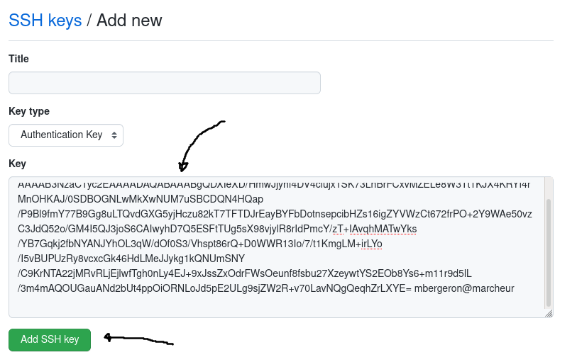

# Pour modifier ce site

## Pour les nouveaux contributeurs

1. Voir https://cartesjava.github.io/annexes/annexe_modifier_manuel/

## Pour les propriétaires du dépôt Git

### Préalables

1. Installer <a href="https://git-scm.com/downloads">Git</a>
1. Installer <a href="https://gohugo.io/installation">Hugo</a>

### Créer et ajouter sa clé USB

1. Ouvrir un GitBash et faire la commande suivante

    ```bash
    $ ssh-keygen
    ```

    * Appuyer sur <kbd>Entrée</kbd> pour choisir les options par défaut

1. Sur GitHub, ouvrir les paramètres du profil

    

1. Choisir *SSH and GPG keys*, puis *New SSH key*

    

1. Ouvrir votre clé SSH publique 

    ```bash
    $ notepad.exe ~/.ssh/id_rsa.pub
    ```

    * alternativement: ouvrir Bloc Note et ouvrir le fichier suivant
        * `C:` => `Users` => *mon usager* => `.ssh` => ouvrir `id_rsa.pub`

1. Copier-coller le texte de votre clé sur GitHub

    

1. Appuyer sur *Add SSH key*

### Cloner le dépôt Git via SSH

```bash
$ git clone https://cartesjava.github.io/annexes/annexe_modifier_manuel/
```

#### Modifier les sources en local

1. Voici les répertoires importants


#### Pousser des modifications sur GitHub

1. Ouvrir GitBash à la racine du dépôt Git

    ```bash
    $ git add .
    $ git commit -a -m"titre de la modification"
    ```

1. asdf


