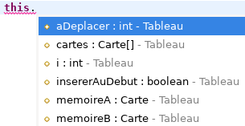
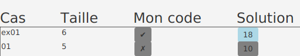

{}

## Préalables

* JDK 11 ou plus récent (testé jusqu'à JDK 18)
* Git
* Eclipse

## Créer le projet

1. Télécharger {}.

1. Copier le fichier `shift.zip` **à la racine** d'un répertoire de travail vide.

1. Extraire les fichiers **directement** à la racine de ce répertoire de travail&nbsp;:

    1. Clic-droit sur le fichier => *Extraire tout*.

    1. **Effacer `shift` du chemin proposé**.

    1. Cliquer sur *Extraire*.

    1. Choisir *Remplacer les fichiers dans la destination*.

    1. Vérifier que les fichiers sont **à la racine** du répertoire de travail.


1. Ouvrir Git Bash **à la racine** du répertoire de travail&nbsp;:

    * *Windows 10*&nbsp;: Clic-droit => *Git Bash Here*.
    * *Windows 11*&nbsp;: Clic-droit => *Show more options* => *Git Bash Here*.

1. En Git Bash, exécuter le script `ajouter_atelier.sh`&nbsp;:

    ```bash
    $ sh scripts/ajouter_atelier.sh
    ```

    * Au besoin, fermer Eclipse avant d'exécuter le script.

    * Appuyer sur {} dans la fenêtre Git Bash pour vraiment lancer le script.

1. Attendre que le script termine.

1. Ouvrir Eclipse et importer le projet `shift`

    1. *File* => *Import* => *Existing Projects into Workspace*.

    1. Cliquer sur *Browse* et naviguer jusqu'à la racine du répertoire de travail.

    1. Cliquer sur *Sélectionner un dossier*.

    1. Vérifier que le projet apparaît dans la case *Projects*.

    1. Cliquer sur *Finish*.


## Créer la classe `MonTableau`

1. Dans Eclipse, sélectionner le projet `shift`

1. Ajouter la classe suivante au projet `shift`&nbsp;:
    * Nom de la classe&nbsp;: `MonTableau`
    * **Ne pas** cocher `public static ...`

1. Ouvrir la classe `MonTableau` et ajuster la signature&nbsp;:

    ```java
    public class MonTableau extends Tableau {
    ```

1. En utilisant le raccourci {}, effectuer les tâches suivantes&nbsp;:
    1. Importer la classe `Tableau`

    1. Ajouter l'annotation `@SuppressWarnings("serial")`

## Créer la classe `Procedure`

1. Ajouter la classe suivante au projet `shift`
    * Nom de la classe&nbsp;: `Procedure`
    * **Cocher** `public static ...`

1. Ouvrir la classe `Procedure` et ajuster la signature.

    ```java
    public class Procedure extends ProcedureDecaler<MonTableau> {
    ```

1. En utilisant le raccourci {}, effectuer les tâches suivantes&nbsp;:
    1. Importer la classe `ProcedureDecaler`

    1. Ajouter la méthode obligatoire `classeMonTableau`

1. Ajouter le code suivant à la méthode `main`&nbsp;:

    ```java
    public static void main(String[] args) {
        NtroClientFx.launch(args);
    }
    ```

    * Utiliser {} pour corriger les erreurs de compilation.

1. Ajouter le code suivant à la méthode `classeMonTableau`&nbsp;:

    ```java
    protected Class<MonTableau> classeMonTableau() {
        return MonTableau.class;
    }
    ```

## Coder les procédures dans la classe `MonTableau`

1. Ouvrir `MonTableau`

1. Ajouter la méthode suivante&nbsp;:

    ```java
    @Override
    public void deplacerDecaler() {

    }
    ```

1. Par héritage, `MonTableau` contient déjà les attributs que vous devez utiliser.

    

    

**IMPORTANT** 

* Il faut utiliser ces attributs plutôt que des variables.
    * P.&nbsp;ex. utiliser l'attribut `i` dans la boucle `for` et non une variable `int i`
* Sinon, l'outil de validation ne pourra pas visualiser l'exécution de votre code.

    


1. Coder les deux procédures directement dans la méthode `deplacerDecaler`
    * La méthode `deplacerDecaler` sera appelée par l'outil de validation pour exécuter une de vos procédures.
    * Selon la valeur de l'attribut `insererAuDebut`, votre code devra exécuter la procédure pour déplacer au début, ou sinon la procédure pour déplacer à la fin.
    * **TRUC** ajouter des méthodes privées à votre classe `MonTableau` et les appeler selon la valeur de `insererAuDebut`

## Exécuter l'outil de validation

* Faire un clic-droit sur `Procedure.java` => *Run As* => *Java Application*.

* L'outil va vous indiquer si votre code est une solution (✔) ou s'il contient une ou des erreurs (✗).

    

    

**IMPORTANT** 

* Il faut quand même regarder la console pour voir les exceptions de type `IndexOutOfBounds` ou `NullPointerException`
* Vous pouvez quand même utiliser le débogueur.

    

## Utiliser l'outil de validation pour visualiser votre code

* Pour que l'outil puisse afficher chacune des étapes de la procédure, vous devez ajouter à la main des instructions `Execution.ajouterEtape()`, p.&nbsp;ex.

    ```java
    @Override
    public void deplacerDecaler() {

        i = 0;

        Execution.ajouterEtape();

        memoireA = cartes[0];

        Execution.ajouterEtape();
    }
    ```

    * C'est à vous de décider ce qui constitue une étape. 
    * Cela n'influence pas la validation, mais vous permet de visualiser ce que votre code fait et pourrait vous aider à trouver des erreurs

## Question bonus 

* Coder une autre procédure qui implante l'opération *déplacer au début*.

* Avec l'outil de validation, comparer le nombre d'étapes entre la procédure vue en théorie et la vôtre.

* Quelle est la différence d'efficacité&nbsp;? Est-ce une grosse différence selon vous&nbsp;?
