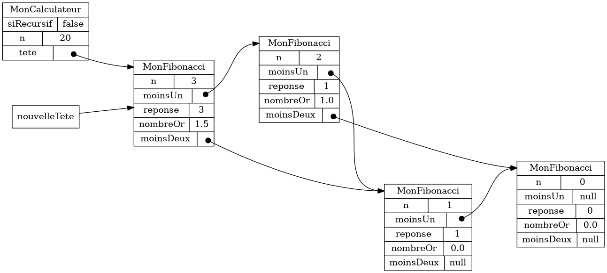

{}

## Créer le projet

1. Télécharger {}

1. Copier le fichier `atelier2_3.zip` **à la racine** de mon dépôt Git

1. Extraire les fichiers **directement** à la racine du dépôt Git

    * Clic-droit sur le fichier => *Extraire tout*

    * **Effacer `atelier2_3` du chemin proposé**

    * Cliquer sur *Extraire*

    * Choisir *Remplacer les fichiers dans la destination*

    * Vérifier que les fichiers sont **à la racine** du dépôt Git 

        * dans le même répertoire que `.git`


1. Ouvrir *Git Bash* **à la racine** de mon dépôt Git

    * *Windows 10* : Clic-droit => *Git Bash Here*
    * *Windows 11* : Clic-droit => *Show more options* => *Git Bash Here*

1. En Git Bash, exécuter le script `ajouter_atelier.sh`

    ```bash
    $ sh scripts/ajouter_atelier.sh
    ```

    * au besoin fermer Eclipse avant d'exécuter le script

    * appuyer sur {} dans fenêtre *Git Bash* pour vraiment lancer le script


1. Attendre que le script termine

1. Ouvrir Eclipse et importer le projet `atelier2_3`

    * *File* => *Import* => *Existing Projects into Workspace*

    * Cliquer sur *Browse* et naviguer jusqu'à la racine de mon dépôt Git

    * Cliquer sur *Sélectionner un dossier*

    * Vérifier que le projet `atelier2_3` apparaît dans la case *Projects*

    * Cliquer sur *Finish*


## Créer la classe `MonFibonacci`

1. Ajouter la classe suivante au projet `atelier2_3`
    * Nom de la classe: `MonFibonacci`
    * **Ne pas** cocher `public static ...`

1. Ouvrir la classe `MonFibonacci` et ajuster la signature

    ```java
    public class MonFibonacci extends Fibonacci {
    ```

1. En utilisant le raccourci {}, effectuer les tâches suivantes
    * importer la classe `Fibonacci`

    * ajouter l'annotation `@SuppressWarnings("serial")`

1. Ajouter la méthode `calculerReponseEtNombreOr`

    ```java
    @Override
    public void calculerReponseEtNombreOr() {

    }
    ```

1. Ajouter la méthode `construireGrapheRecursivement`

    ```java
    @Override
    public void construireGrapheRecursivement() {

    }
    ```

## Créer la classe `MonCalculateur`

1. Ajouter la classe suivante au projet `atelier2_3`
    * Nom de la classe: `MonCalculateur`
    * **Ne pas** cocher `public static ...`

1. Ouvrir la classe `MonCalculateur` et ajuster la signature

    ```java
    public class MonCalculateur extends Calculateur {
    ```

1. En utilisant le raccourci {}, effectuer les tâches suivantes
    * importer la classe `Calculateur`

    * ajouter l'annotation `@SuppressWarnings("serial")`

1. Ajouter la méthode `construireGraphe`

    ```java
    @Override
    public void construireGraphe() {
        if(siRecursif) {

            // construire le graphe récursivement

        }else {

            // construire le graphe dynamiquement

        }
    }
    ```

## Créer la classe `Procedure`

1. Ajouter la classe suivante au projet `atelier2_3`
    * Nom de la classe: `Procedure`
    * **cocher** `public static ...`

1. Ouvrir la classe `Procedure` et ajuster la signature

    ```java
    public class Procedure extends FibonacciProcedureApp<MonCalculateur, MonFibonacci> {
    ```

1. En utilisant le raccourci {}, effectuer les tâches suivantes
    * importer la classe `FibonacciProcedureApp`

    * ajouter la méthode obligatoire `classeCalculateur`

    * ajouter la méthode obligatoire `classeFibonacci`

1. Ajouter le code suivant à la méthode `main`

    ```java
    public static void main(String[] args) {
        NtroClientFx.launch(args);
    }
    ```

    * utiliser {} pour corriger les erreurs de compilation

1. Ajouter le code suivant à la méthode `classeCalculateur`

    ```java
    @Override
    protected Class<MonCalculateur> classeCalculateur() {
        return MonCalculateur.class;
    }
    ```

1. Ajouter le code suivant à la méthode `classeFibonacci`

    ```java
    @Override
    protected Class<MonFibonacci> classeFibonacci() {
        return MonFibonacci.class;
    }
    ```

## Exécuter l'outil de validation une première fois

* Dans Eclipse, sélectionner le projet `atelier2_3`

* Clic-droit sur la classe `Procedure`

    * *Run As* => *Java Application*

## Compléter la version récursive

* Compléter la méthode `calculerReponseEtNombreOr`

* Compléter la méthode `construireGrapheRecursivement`

* Compléter la méthode `construireGraphe`, version récursive

* Exécuter l'outil de validation pour tester mon code

## Compléter la méthode `construireGraphe`, version dynamique

* Voici des graphes pour m'aider à implanter la création de la nouvelle tête

    1. Utiliser une variable `nouvelleTete`

        

    1. Créer un nouvel objet `MonFibonacci`

        

    1. Le `moinsUn` de la `nouvelleTete` doit pointer vers la `tete` actuelle 
        * (et le `moinsDeux` de la `nouvelleTete` doit pointer vers le `moinUn` de la `tete` actuelle)

            

    1. La `tete` devient maintenant la `nouvelleTete`

        

    1. Calculer la réponse avant de continuer la boucle

        

* Exécuter l'outil de validation pour tester mon code


## Question bonus: modélisation plus simple

* Utiliser une modélisation plus simple pour calculer la suite de Fibonacci

* Pour valider, construire le même graphe d'objets à partir de la modélisation plus simple


