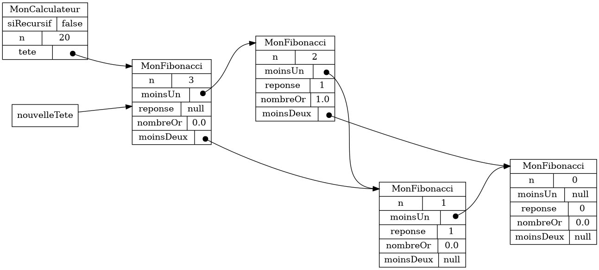

{}

## Préalables

* JDK 11 ou plus récent (testé jusqu'à JDK 18)
* Git
* Eclipse

## Créer le projet

1. Télécharger {}.

1. Copier le fichier `fiboacci.zip` **à la racine** d'un répertoire de travail vide.

1. Extraire les fichiers **directement** à la racine de ce répertoire de travail&nbsp;:

    1. Clic-droit sur le fichier => *Extraire tout*.

    1. **Effacer `fibonacci` du chemin proposé**.

    1. Cliquer sur *Extraire*.

    1. Choisir *Remplacer les fichiers dans la destination*.

    1. Vérifier que les fichiers sont **à la racine** du répertoire de travail.


1. Ouvrir Git Bash **à la racine** de mon répertoire de travail&nbsp;:

    * *Windows 10*&nbsp;: Clic-droit => *Git Bash Here*.
    * *Windows 11*&nbsp;: Clic-droit => *Show more options* => *Git Bash Here*.

1. En Git Bash, exécuter le script `ajouter_atelier.sh`&nbsp;:

    ```bash
    $ sh scripts/ajouter_atelier.sh
    ```

    * Au besoin, fermer Eclipse avant d'exécuter le script.

    * Appuyer sur {} dans fenêtre Git Bash pour vraiment lancer le script.


1. Attendre que le script termine.

1. Ouvrir Eclipse et importer le projet `fibonacci`&nbsp;:

    1. *File* => *Import* => *Existing Projects into Workspace*.

    1. Cliquer sur *Browse* et naviguer jusqu'à la racine de mon dépôt Git.

    1. Cliquer sur *Sélectionner un dossier*.

    1. Cérifier que le projet `fibonacci` apparaît dans la case *Projects*.

    1. Cliquer sur *Finish*.


## Créer la classe `MonFibonacci`

1. Ajouter la classe suivante au projet `fibonacci`&nbsp;:

    * Nom de la classe&nbsp;: `MonFibonacci`

    * **Ne pas** cocher `public static ...`

1. Ouvrir la classe `MonFibonacci` et ajuster la signature&nbsp;:

    ```java
    public class MonFibonacci extends Fibonacci {
    ```

1. En utilisant le raccourci {}, effectuer les tâches suivantes&nbsp;:

    1. Importer la classe `Fibonacci`

    1. Ajouter l'annotation `@SuppressWarnings("serial")`

1. Ajouter la méthode `calculerReponseEtNombreOr`&nbsp;:

    ```java
    @Override
    public void calculerReponseEtNombreOr() {

    }
    ```

1. Ajouter la méthode `construireGrapheRecursivement`&nbsp;:

    ```java
    @Override
    public void construireGrapheRecursivement() {

    }
    ```

## Créer la classe `MonCalculateur`

1. Ajouter la classe suivante au projet `atelier2_3`&nbsp;:

    * Nom de la classe&nbsp;: `MonCalculateur`

    * **Ne pas** cocher `public static ...`

1. Ouvrir la classe `MonCalculateur` et ajuster la signature&nbsp;:

    ```java
    public class MonCalculateur extends Calculateur {
    ```

1. En utilisant le raccourci {}, effectuer les tâches suivantes&nbsp;:

    1. Importer la classe `Calculateur`

    1. Ajouter l'annotation `@SuppressWarnings("serial")`

1. Ajouter la méthode `construireGraphe`&nbsp;:

    ```java
    @Override
    public void construireGraphe() {
        if(siRecursif) {

            // construire le graphe récursivement

        }else {

            // construire le graphe dynamiquement

        }
    }
    ```

## Créer la classe `Procedure`

1. Ajouter la classe suivante au projet `fibonacci`&nbsp;:

    * Nom de la classe&nbsp;: `Procedure`

    * **Cocher** `public static ...`

1. Ouvrir la classe `Procedure` et ajuster la signature&nbsp;:

    ```java
    public class Procedure extends FibonacciProcedureApp<MonCalculateur, MonFibonacci> {
    ```

1. En utilisant le raccourci {}, effectuer les tâches suivantes&nbsp;:

    1. Importer la classe `FibonacciProcedureApp`

    1. Ajouter la méthode obligatoire `classeCalculateur`

    1. Ajouter la méthode obligatoire `classeFibonacci`

1. Ajouter le code suivant à la méthode `main`&nbsp;:

    ```java
    public static void main(String[] args) {
        NtroClientFx.launch(args);
    }
    ```

    * Utiliser {} pour corriger les erreurs de compilation

1. Ajouter le code suivant à la méthode `classeCalculateur`&nbsp;:

    ```java
    @Override
    protected Class<MonCalculateur> classeCalculateur() {
        return MonCalculateur.class;
    }
    ```

1. Ajouter le code suivant à la méthode `classeFibonacci`&nbsp;:

    ```java
    @Override
    protected Class<MonFibonacci> classeFibonacci() {
        return MonFibonacci.class;
    }
    ```

## Exécuter l'outil de validation une première fois

* Dans Eclipse, sélectionner le projet `fibonacci`

* Clic-droit sur la classe `Procedure`&nbsp;:

    * *Run As* => *Java Application*.

## Compléter la version récursive

* Compléter la méthode `calculerReponseEtNombreOr`

* Compléter la méthode `construireGrapheRecursivement`

* Compléter la méthode `construireGraphe`, version récursive.

* Exécuter l'outil de validation pour tester mon code.

## Compléter la méthode `construireGraphe`, version dynamique

* Voici des graphes pour m'aider à implanter la création de la nouvelle tête&nbsp;:

    1. Utiliser une variable `nouvelleTete`

        

    1. Créer un nouvel objet `MonFibonacci`

        

    1. Le `moinsUn` de la `nouvelleTete` doit pointer vers la `tete` actuelle
        * (et le `moinsDeux` de la `nouvelleTete` doit pointer vers le `moinUn` de la `tete` actuelle).

            

    1. La `tete` devient maintenant la `nouvelleTete`

        

    1. Calculer la réponse avant de continuer la boucle

        

* Exécuter l'outil de validation pour tester mon code.


## Question bonus&nbsp;: modélisation plus simple

* Utiliser une modélisation plus simple pour calculer la suite de Fibonacci.

* Pour valider, construire le même graphe d'objets à partir de la modélisation plus simple.


