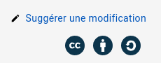

# Comment modifier ce manuel

## Obtenir les sources

Le dépôt source est ici: https://github.com/cartesjava/cartesjava.github.io

## Suggérer une modification

1. Au bas de la page à modifier, cliquer sur *Suggérer une modification*

    

1. Se connecter à GitHub

1. La première fois uniquement

    * «forker» le dépôt

        

1. Modifier le source de la page directement dans votre naviguateur

    

1. Décrire votre modification (commentaire de commit)

    

1. Créer un «pull request» pour communiquer votre suggestion au propriétaire du dépôt d'origine

    * Étape 1

        

    * Étape 2

        

1. Attendre que le propriétaire du dépôt d'origine évalue votre suggestion


## Modifier le manuel en local

1. Installer <a href="https://gohugo.io/" target="_blank">Hugo</a> sur votre machine

1. Démarrer Hugo à la racine du dépôt Git `cartesjava.github.io`

    ```bash
    $ hugo server
    ```

1. Naviguer vers <a href="http://localhost:1313" target="blank">localhost:1313</a>


    
