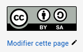
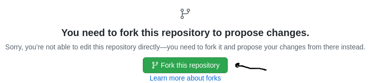
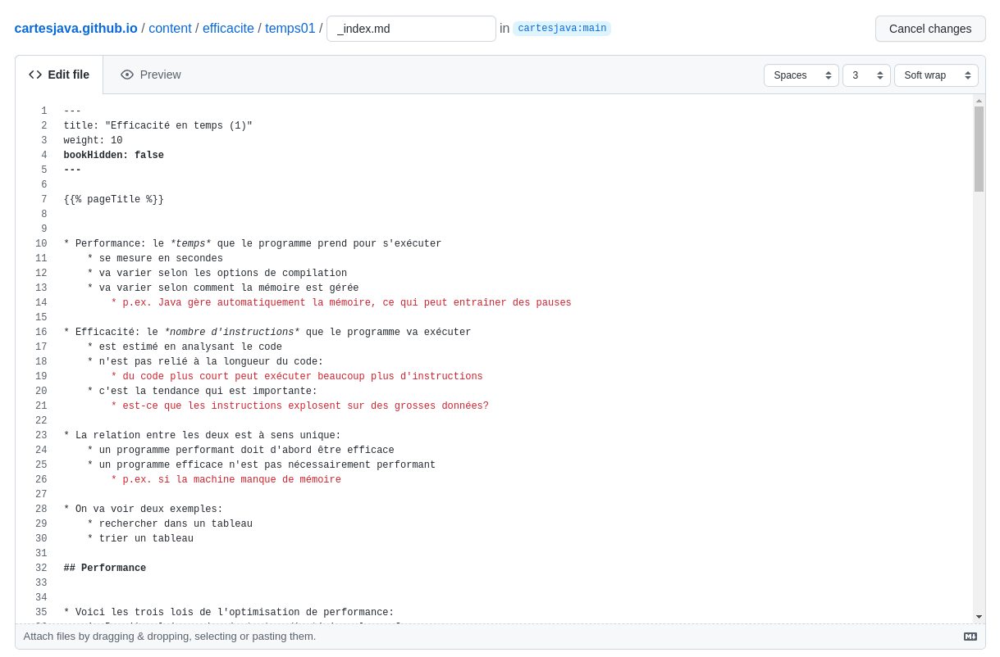
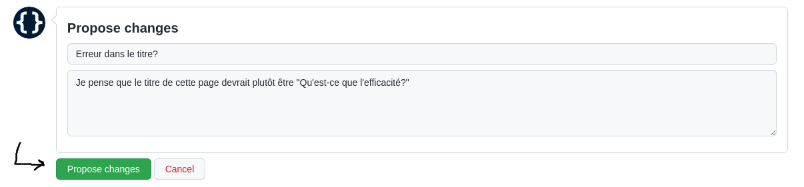
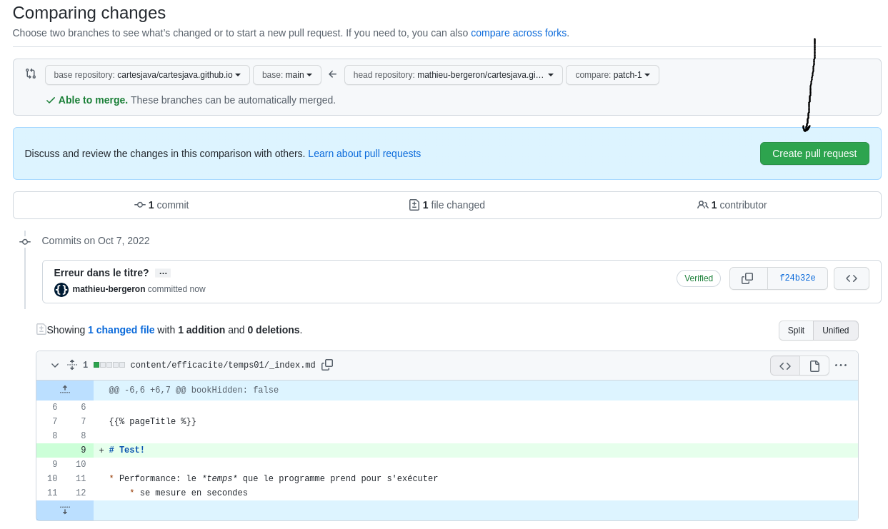
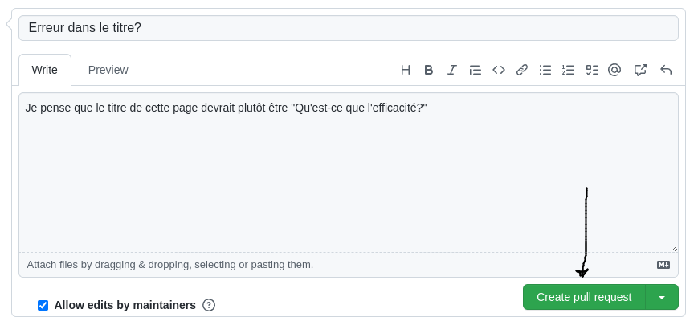
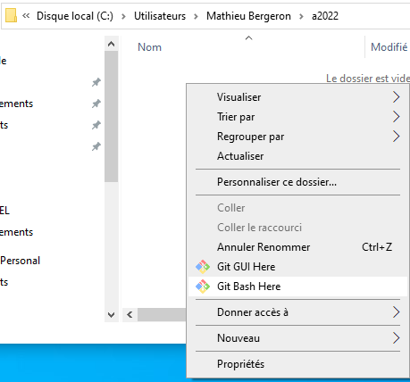

# Comment modifier ce manuel


## Obtenir les sources

Le dépôt source est ici&nbsp;: https://github.com/cartesjava/cartesjava.github.io

## Suggérer une modification

1. Au bas de la page à modifier, cliquer sur *Modifier cette page*

    

1. Se connecter à GitHub

1. La première fois uniquement

    * «forker» le dépôt

        

1. Modifier le source de la page directement dans votre navigateur

    

1. Décrire votre modification (commentaire de commit)

    

1. Créer un «pull request» pour communiquer votre suggestion au propriétaire du dépôt d'origine

    * Étape 1

        

    * Étape 2

        

1. Attendre que le propriétaire du dépôt d'origine évalue votre suggestion


## Modifier le manuel en local

1. Installer <a href="https://gohugo.io/" target="_blank">Hugo</a> sur votre machine

1. Faire la commande suivante pour cloner le dépôt Git

    ```bash
    $ git clone https://github.com/cartesjava/cartesjava.github.io.git
    ```

1. La racine de ce dépôt Git est le répertoire contenant les fichiers suivants:

    ```bash
    ├── archetypes
    ├── assets
    ├── config.yaml
    ├── content
    ├── docs
    ├── .git
    ├── .gitignore
    ├── i18n
    ├── layouts
    ├── nodes
    ├── parametres01.png
    ├── parametres02.png
    ├── parametres03.png
    ├── README.md
    ├── resources
    ├── scripts
    ├── src
    └── static
    ```

1. Pour ouvrir un GitBash à la racine du dépôt Git, faire
    * Démarrer un explorateur de fichier Windows
    * Naviguer jusqu'à la racine de dépôt Git
    * *Clic-droit* => *GitBash here*

        


1. Démarrer Hugo à la racine du dépôt Git `cartesjava.github.io`

    ```bash
    $ hugo server
    ```

1. Naviguer vers <a href="http://localhost:1313" target="blank">localhost:1313</a>

1. Voici les fichiers et répertoires importants

    ```bash
    ├── assets            # répertoire avec les .css
    ├── config.yaml       # configuration du site
    ├── content           # sources pour le contenu
    │   ├── annexes         
    │   ├── approche
    │   ├── arbres
    │   ├── bibliographie
    │   ├── conclusion
    │   ├── efficacite
    │   ├── _index.md
    │   ├── intro
    │   ├── listes
    │   ├── mappages
    │   ├── modelisation
    │   ├── preface
    │   └── procedures
    ├── docs             # fichiers .html pour publication
    ├── src              # sources pour les extensions à Hugo
    └── static           # images et fichiers statiques
    ```

## Modifier directement la version publique de ce manuel

1. Vous devez avoir les droits en écriture pour le dépôt Git

1. Voir le *README* sur la page Web du dépôt&nbsp;:

    * https://github.com/cartesjava/cartesjava.github.io
