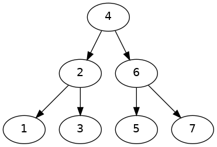
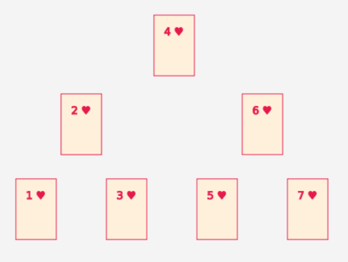

{}

## Tableau


1. On va visualiser le code suivant

    ```java
    Carte[] cartes;

    int aDeplacer;
    int i;

    Carte memoireA;
    Carte memoireB;
    ```

    


Une carte blanche représente une case vide (valeur `null`)


## Arbre





```json
{}
```


        

