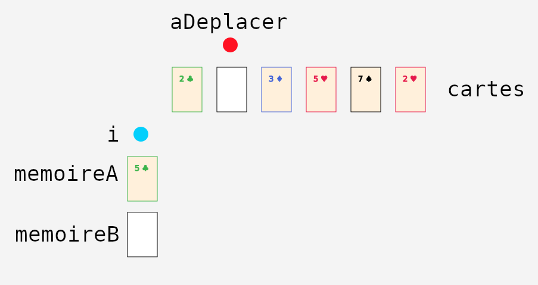

{}

Dans notre approche, il n'y a pas de façon unique de visualiser les données d'une procédure informatique avec des cartes à jouer.
Pour chaque procédure, il faut donc spécifier la visualisation à utiliser (l'<a href="/annexes/annexe_programmer_exemple/">Annexe 3</a> explique comment programmer une nouvelle visualisation).
Nous donnons ici deux exemples de telles visualisations.

## Liste ou tableau à une dimension

Lorsque les données sont sous la forme d'une liste (ou d'un tableau à une dimension), on peut facilement visualiser cette liste 
par une séquence de cartes disposées, p.&nbsp;ex. de gauche à droite.
On peut aussi utiliser des marqueurs (petits objets) pour représenter des positions (indices) dans cette liste.

P.&nbsp;ex. le code suivant&nbsp;:

```java
Carte[] cartes;

int aDeplacer;
int i;

Carte memoireA;
Carte memoireB;
```

est aisément visualiser par les cartes et les marqueurs suivants&nbsp;:



À noter qu'une carte blanche représente une case vide (valeur `null`).

## Arbre

Dans le cas où les données sont organisées sous forme d'arbre, on peut visualiser les données en disposant aussi les cartes en forme d'arbre.

P.&nbsp;ex. l'arbre suivant (racine en haut, comme le veut la convention)&nbsp;:


Serait visualisé par les cartes suivantes&nbsp;:


À noter que la visualisation dépend d'une compréhension préalable de la notion d'arbre (de la forme d'un arbre).
Cette compréhension préalable risque d'être moins acquise chez les étudiant·e·s que celle de séquence utilisée ci-haut.
Néanmoins, utiliser des cartes peut s'avérer plus intuitif pour les novices que le format textuel.
P.&nbsp;ex. voici le même arbre en JSON&nbsp;:

```json
{}
```


        

