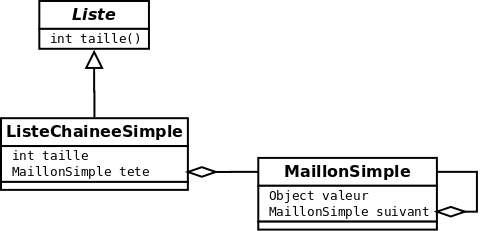
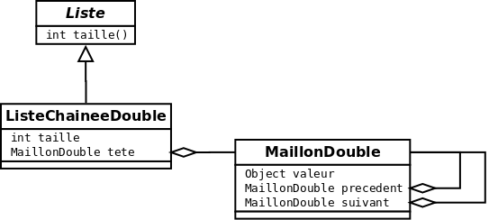
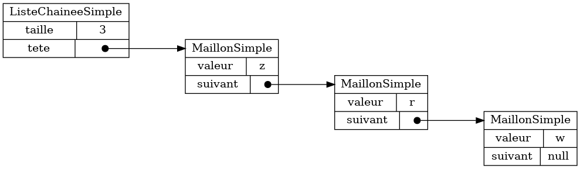
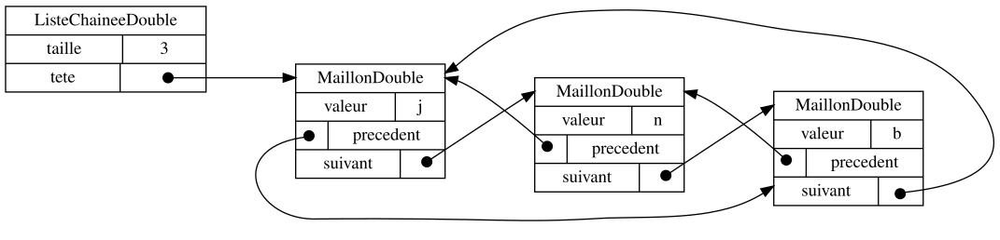

{}

## Diagramme de classes et Java

Nous utilisons le langage de programmation Java pour les exemples de code de ce manuel. Au besoin, nous vous invitons à vous référer à <a href="/bibliographie#mayfield-allen-2020">Think Java (Mayfield et Allen; 2020)</a> pour une introduction à ce langage.

Pour visualiser les types de données, nous utilisons des digrammes de classe.
Voici par exemple un diagramme de classe représentant une liste chaînée simple.



Chaque boîte dénote une classe. Une boîte a typiquement trois sections. La
première section à partir du haut est le nom de la classe, p.ex. *Liste*
(lorsque la classe est abstraite, ce nom sera en italique). La deuxième section
dénote les méthodes, p.ex. `int taille()`.  La dernière section dénote les
attributs, p.ex. `int taille`. La flèche triangulaire dénote l'héritage (le
triangle est collé sur la classe parent).  Par exemple, la classe
`ListeChaineeSimple` hérite de la classe `Liste` (puisque `Liste` est abstraite,
on peut aussi dire que `ListeChaineeSimple` implante une `Liste`).  La flèche
avec un losange dénote une référence (le losange est collé sur la classe qui
maintient la référence, puis spécifiquement sur l'attribut qui maintient cette
référence).  Par exemple, une `ListeChaineeSimple` maintient une référence à un
`MaillonSimple`. Plus spécifiquement, c'est l'attribut `tete` qui maintient cette référence.

Voici un autre exemple de diagramme de classes, cette fois-ci d'une liste chaînée double.



À note que le `MaillonDouble` maintient deux références à d'autre
`MaillonDouble` (le `suivant` et le `precedent`).  Quand une classe maintient
une référence à des objets de son propre type, on parle alors de types
récursifs.

## Graphe d'objets

Le diagramme de classe représente le type de données qu'on modélise,
mais ne peut pas représenter des données concrètes.
Pour ce faire, nous utilisons des graphes d'objets.

Voici un graphe d'objet pour une liste chaînée simple.



Chaque boîte dénote un objet. Une boîte a une ou plusieurs sections.
La première section à partir du haut dénote la classe de l'objet 
et les sections suivantes dénotent la valeur des différents attributs de cet objet.
Par exemple, le graphe ci-haut contient une seule boîte où la classe est `ListeChaineeSimple`.
On dit qu'il s'agit d'un objet de type `ListeChaineeSimple`.
Les attributs sont `taille` (valeur `3`) et `tete` (référence à un objet de type `MaillonSimple`).

Voici un deuxième exemple de graphe d'objets, cette fois-ci pour une liste chaînée double.



À noter comment les références `suivant` et `precedent` forment des cycles dans le graphe 
d'objet, ce qui est toujours possibles avec les types récursifs et, en général, dans 
l'organisation en mémoire des données d'un programme.
Il est important d'encourager les étudiant·e·s à garder en tête la possibilité de tels cycles
dans les données, puisqu'un programme doit les détecter afin de ne pas s'exécuter en boucle infinie.


## JSON

Nous utilisons aussi le format JSON pour représenter les données.
JSON veut dire *Javascript Object Notation* et c'est le format privilégié pour les applications Web
et les bases de données NoSQL.

Voici les *valeurs* en JSON:

* la valeur nulle: `null`
* un booléen: `true`  ou `false`
* un nombre comme: `1`, `4.5`, `-10.1` 
* une chaîne comme: `"asdf"`, `""`, `"Bonjour!"`

Voici les *structures* en JSON:

* une liste comme: 
    * `[1, 3, -1]`
    * `[]`
    * `["asfd", "Bonjour!", ""]`
* une objet comme: 
    * `{"cle01":true}`
    * `{}`
    * `{"cle01":true, "cle02":-12}`

Une liste est un tableau qui peut grandir et rapetisser. Une des particularités
des la liste JSON est de mélanger les types de valeurs:

* `[1,true,"Bonjour!"]`
* `[null, "", 1, false]`

Un objet JSON permet d'accéder à des valeurs avec des clés (comme un mappage).
En JSON, une clé est toujours une chaîne.
La valeur peut être n'importe quelle valeur JSON

À noter aussi que JSON est un format récursif.

* on peut avoir `[1,2,[2,4]]` (une liste à l'intérieur d'une liste)
* on peut avoir `[1,2,[2,[5,423]]]` 
* on peut avoir `[1,2,[2,[[44,2],423]]]` 
* etc.

Voici la même liste chaîne simple que ci-haut, mais dans le format JSON.

```json
{}
```

À noter que JSON ne permet pas de représenter le type de donnée (la classe).
Par convention, nous représenterons la classe à l'attribut spécial `"_C":"NomDeLaClasse"`.

Finalement, voici la même liste chaînée double que ci-haut, mais exprimée en JSON.

```json
{}
```

À noter que JSON ne contient de pas de mécanisme officiel pour représenter les références.
Par convention, nous représentons une référence grâce à un objet spécial de la forme `{ "_R": "/chemin/vers/objet"}`
où le chemin vers l'objet permet de l'identifier à partir de la racine du fichier JSON.


