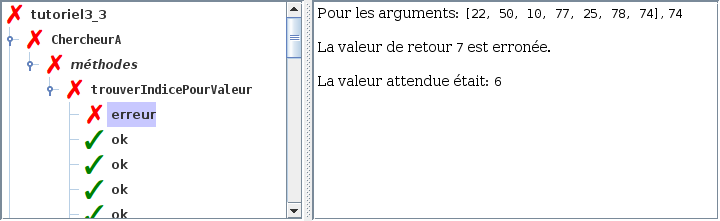
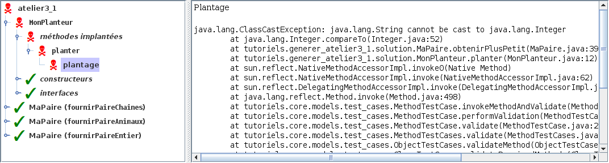
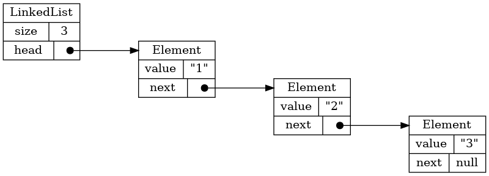
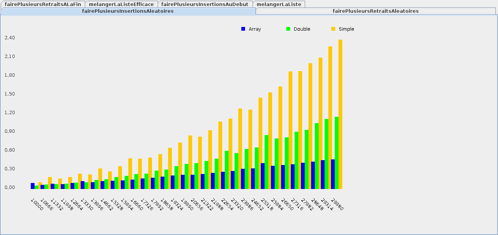
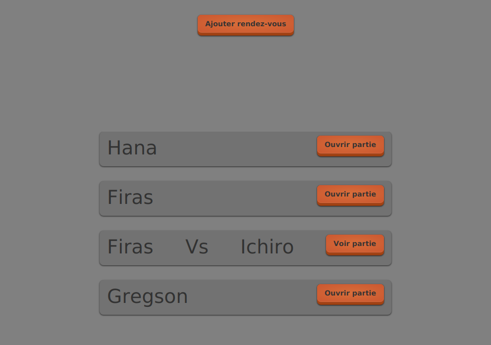
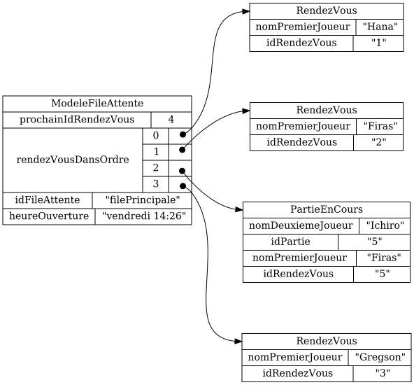
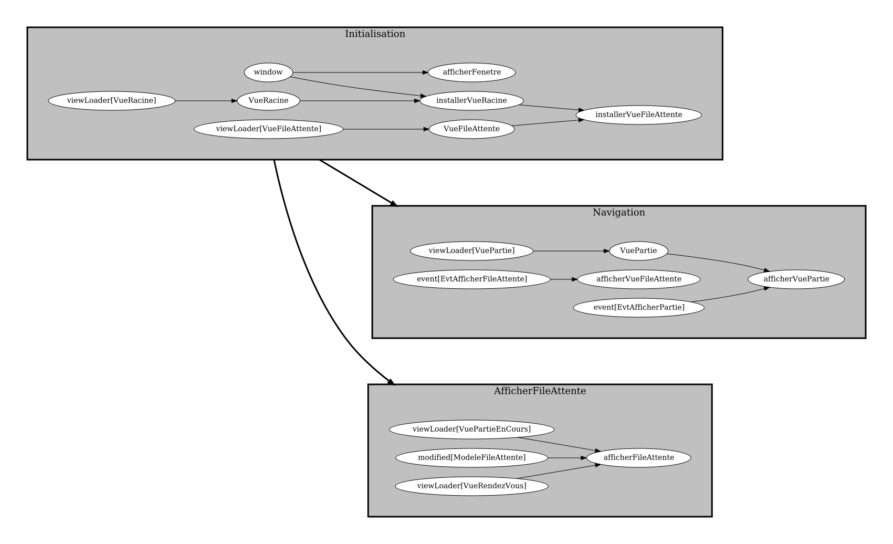

# Outils pour enseigner la programmation

Code source: [github.com/mathieu-bergeron](https://github.com/mathieu-bergeron)

 

Prononcé «intro», Ntro est conçu pour les novices sachant déjà programmer, mais éprouvant certaines difficultés à:

* imaginer comment les données sont organisées en mémoire
* imaginer les différentes tâches effectuées par le programme et leurs interdépendances
* décortiquer les messages d'erreurs de Java
* réfléchir à l'efficacité du programme
* modéliser les données d'une application (créer des modèles)

## Auto-valider un atelier de façon interactive

 

Code source: [github.com/mathieu-bergeron/validation_de_tutoriels](https://github.com/mathieu-bergeron/validation_de_tutoriels)

## Visualiser les structures de données

## Visualiser l'efficacité d'une structure de données

## Visualiser le modèle d'une application graphique

## Visualiser les tâches d'une application graphique

