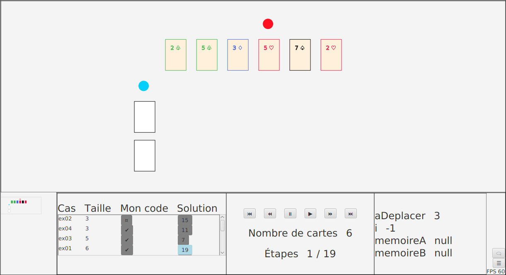
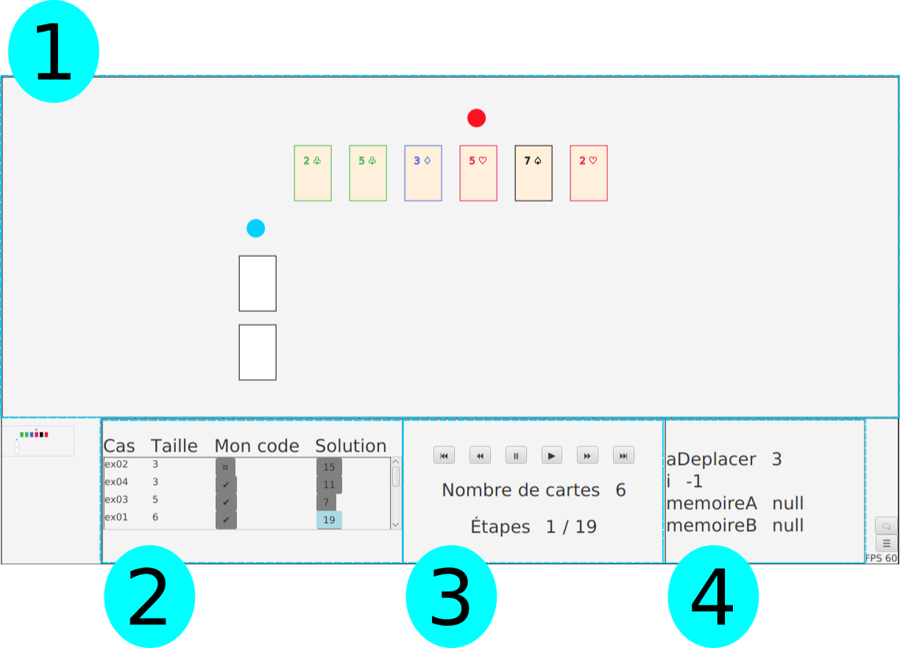
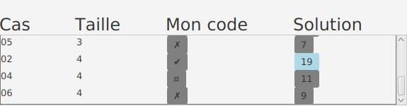
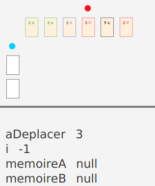
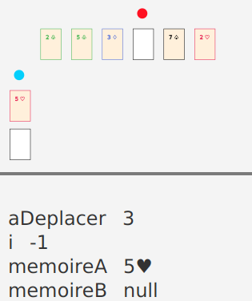
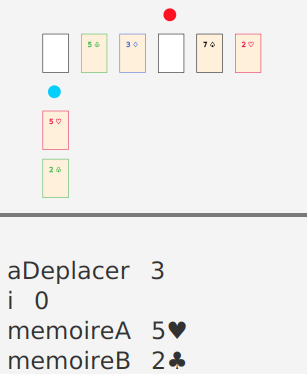
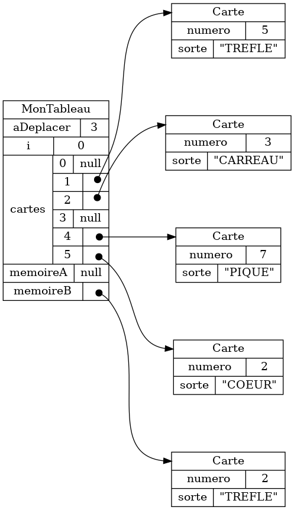

{}


## Démarrer l'outil

Pour utiliser l'outil de validation, il faut l'intégrer à un projet Java. 
Pour l'exemple présenter en <a href="/intro">introduction</a>, on 
débutera avec le code suivant:

```java
{}
```

```java
{}
```

À l'exception de la méthode `deplacerDelacer`, qui doit être complétée, les
étudiant·es n'ont pas à comprendre ce code, qui ne sert qu'à intégrer
l'outil de validation à leur projet Java. Pour plus de détails, voir les exemples d'ateliers
à <a href="/annexe-ateliers">l'Annexe 4</a>.

Exécuter le projet Java va démarrer l'outil:

<center>

</center>


À noter que bien que le manuel fait référence à un outil de validation (au
singulier), il faut en réalité intégrer une version différente de l'outil de
validation pour chaque procédure à valider. Chaque version définit aussi sa
propre visualiation des données avec des cartes à jouer.  Voir <a
href="/annexe-ateliers">l'Annexe 2</a> pour plus de détails.


## Utiliser l'outil

Voici les affichages principaux de l'outil de valiation.

<center>

</center>

* Le panneau principal (1) affiche des cartes à jouer
* Le panneau des cas de tests (2) permet de 
    * sélectionner un nouveau cas de test 
    * visualiser les résultats de la validation
* Le panneau de navigation (3) permet d'avancer et/ou reculer dans la séquence d'exécution
* Le panneau des variables (4) visualise les valeurs de différentes pour l'état courant de l'exécution

### Visualisation avec des cartes à jouer

Des cartes à jouer animées permettent de visualiser l'exécution d'une procédure informatique.

<center>
<div style="max-width:300px;"/>
    {}
</div>
</center>

L'exécution de la procédure se déroule en un certain nombre d'étape. La transition d'une étape à l'autre est illustrée par une animation où, 
par exemple, une carte peut changer de position.

À noter que la visualisation est différente pour chaque procédure, tel qu'expliquer à la <a href="/approche/cartes_a_jouer/">Section 1.3</a>.
À noter aussi qu'utiliser des cartes à jouer s'accompagne de certaines limitations, telles que discutées au <a href="/modelisation">Chapitre 2</a>.


### Sélection de différents cas de test

Au démarrage, l'outil charge plusieurs cas de tests.
La première étape d'un cas de test es 
contient des valeurs pour chaque variable importante de la procédure informatique.
Les étapes subséquentes correspondent à l'exécution de la procédure.

<center>

</center>

Pour chaque cas de test, on peut soit sélectionner une solution ou la validation du code étudiant.
Pour la solution, l'icône représente le nombre d'étapes contenu dans la solution.
Pour le code étudiant, l'icône représente le résultat de validation.

<center>
<table>
<tr>
<th>Symbole </th>
<th>Signification </th>
</tr>


<tr>
<th><span style="font-size:1.5rem;">✔</span></th>
<td>Validation réussie</td>
</tr>

<tr>
<th><span style="font-size:1.5rem;">✗</span></th>
<td>Erreur de validation</td>
</tr>


<tr>
<th><span style="font-size:1.5rem;">¤</span></th>
<td>Plantage lors de la validation</td>
</tr>

</table>
</center>

### Navigation entre les étapes de la procédure

Pour le cas de test sélectionné, on peut naviguer à travers la séquence d'exécution de la procédure.
Cette option est particulièrement utile pour détecter une erreur.
On peut comparer, étape par étape, le déroulement de la solution au déroulement 
de procédure implantée par l'étudiant·e.

<center>
<div style="max-width:300px;"/>
    {}
</div>
</center>


À noter que l'outil de validation exécute la procédure dès le démarrage
Les étapes d'exécution sont ainsi mémorisées à l'avance.
Contrairement à un véritable débogueur, on peut donc reculer dans les étapes d'exécution.

### Valeurs des variables

Le panneau des variables montre comment les valeurs importantes pour la procédure évoluent en cours d'exécution.
Voici un exemple pour quatre étapes.

<center>
<table>
<tr>
<th>Étape 1</th>
<th>Étape 2</th>
</tr>
<tr>
<td>

</td>
<td>

</td>
</tr>
<tr>
<th>Étape 3</th>
<th>Étape 4</th>
</tr>
<td>

</td>
<td>

</td>
</tr>
</table>
</center>

## Expérimenter avec les données 

L'outil supporte la modification en temps réel du fichier de données correspondant aux cartes affichées.
Cette fonctionnalité permet de créer des exercices où les étudiant.es doivent encoder des données de façon à produire la bonne visualisation.

<center>
<div style="max-width:75%;"/>
    {}
</div>
</center>

À noter que l'outil sauvegarde les données dans un fichier `.json` situé dans le répertoire `_storage/models` (le format JSON est présenté à la <a href="/approche/langages_et_notations/#json">Section 1.2.3</a>).


## Trouver des erreurs dans la procédure implantée

Visualiser la procédure à l'aide d'une animation aide les étudiant·es à trouver certaines erreurs, sutout
qu'on peut comparer l'animation produite pour la solution avec celle produite pour le code étudiant.

L'exemple ci-bas illustre une erreur courante dans le code étudiant.
On voit que la procédure correcte s'arrête dès que le marqueur bleu (l'indice `i` dans la boucle) dépasse 
le marqeur rouge (l'indice `aDeplacer` identifiant la carte à déplacer).
Dans le code étudiant, cette condition n'as pas été codée correctement et la procédure 
s'exécute pour des étapes en trop, ce qui mène à un résultat erroné.

<center>
<table>
<tr>
<th>
Procédure correcte (solution)
</th>

<td>
<div style="max-width:300px;"/>
    {}
</div>
</td>
</tr>

<tr>
<th>
Procédure erronée
</th>

<td>
<div style="max-width:300px;"/>
    {}
</div>
</td>
</tr>
</table>
</center>


## Afficher le graphe d'objets

Finalement, l'outil de validation génère génère un graphe d'objet pour les
données courantes et sauvegarde ce graphe dans le répertoire `_storage/graphs`.
(voir la <a href="/approche/langages_et_notations/#graphe-dobjets">Section
1.2.2</a> à propos des graphes d'objets).  Ces graphes permettent aux
étudiant·es de se forger une image mentale de l'organisation des données en
mémoire.  En particulier, puisque les graphes sont générés, les étudiant·es
peuvent consulter les graphes d'objets correspondant à différentes étapes d'une
procédure.

<table>
<tr>
<th>
Données JSON
</th>
<th>
Graphe d'objets
</th>
</tr>

<tr>
<td>

```json
{}
```

</td>

<td>

</td>


</tr>


</table>


