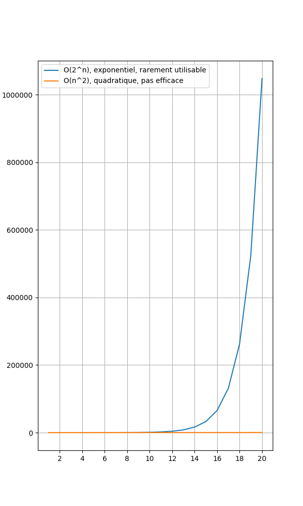
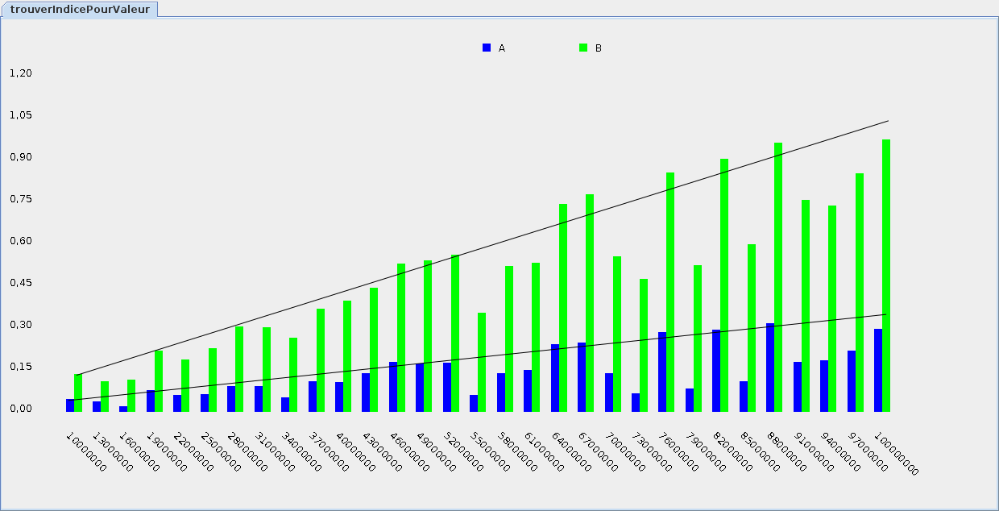

{}


* Performance: le *temps* que le programme prend pour s'exécuter
    * se mesure en secondes
    * va varier selon les options de compilation
    * va varier selon comment la mémoire est gérée
        * p.ex. Java gère automatiquement la mémoire, ce qui peut entraîner des pauses

* Efficacité: le *nombre d'instructions* que le programme va exécuter
    * est estimé en analysant le code
    * n'est pas relié à la longueur du code:
        * du code plus court peut exécuter beaucoup plus d'instructions
    * c'est la tendance qui est importante: 
        * est-ce que les instructions explosent sur des grosses données?

* La relation entre les deux est à sens unique:
    * un programme performant doit d'abord être efficace
    * un programme efficace n'est pas nécessairement performant
        * p.ex. si la machine manque de mémoire

* On va voir deux exemples:
    * rechercher dans un tableau
    * trier un tableau

## Performance


* Voici les trois lois de l'optimisation de performance:
    1. Première loi: ne jamais tenter d'optimiser la performance
    1. Deuxième loi: ne jamais tenter d'optimiser la performance
    1. Troisième loi (pour expert): ne jamais tenter d'optimiser la performance

* Il y a aussi la fameuse citation de Knuth: 
    * "Premature optimization is the root of all evil" 
    * (L'optimisation prématurée est la cause de toutes nos souffrance).

* Pourquoi? 

* Raison 1) optimiser le temps d'exécution est vraiment, vraiment difficile
    * (p.ex. il faut bien connaître les détails de la machine qu'on veut utiliser)

* Raison 2) les programmeurs se trompent souvent sur comment optimiser
    * à vouloir "optimiser", on se retrouve trop souvent avec du code illisible:

```java
{}
```

* En passant:
    * Il s'agit de code Java valide
    * Le code fonctionne et retourne les bonnes valeurs
    * Par contre, il y a une erreur de logique qui affecte son efficacité
    * Qui veut trouver l'erreur et la corriger?

* Évidemment, il y a quand même des cas où il faut optimiser
    * en général, c'est effectué une fois que le programme fonctionne bien
        * c'est un autre projet, possiblement effectué par une autre équipe
    * il faut mesurer (profiler) le programme pour comprendre ce qui bloque
    * souvent, on optimise pour une seule plateforme matérielle à la fois
        * p.ex. optimiser du code réseau pour un modèle précis de routeur


## Efficacité


* Contrairement à la performance, il faut se soucier d'efficacité dès que possible

* C'est heureusement beaucoup plus facile. Il faut:
    * choisir les bonnes structures de données
    * choisir les bons algorithmes 
    * (90% du temps, il suffit d'utiliser du code de librairie)

* L'efficacité n'est pas reliée à la longueur du code, mais bien à comment il s'exécute

* Par exemple, voici une autre méthode de recherche:

```java
{}
```

* Cette fois-ci, le code est plus lisible:
    * on peut vérifier qu'il n'y a pas d'erreur de logique
    * le code est d'ailleurs plus efficace que le précédent

## Théorie de l'efficacité (complexité)

* Il y a beaucoup de théorie au sujet de l'efficacité (appelée souvent complexité)

* En gros, il faut regarder la tendance lorsque le programme traite beaucoup de données
    * si le nombre d'instructions n'augmente pas trop, le programme est efficace
    * si le nombre d'instructions explose, alors le programme n'est pas efficace

* Considérer p.ex. un programme pour trier un tableau:


* Le graphique ci-haut montre la taille des tableaux à trier et le temps d'exécution en secondes

* Le programme semble efficace pour les tableaux de tailles `1000` à `30700`
    * les temps d'exécution vont de `~0` secondes à `~3` secondes

* Pour être vraiment considérer efficace, il faudrait que la tendance soit une droite:


* Le cas où c'est une droite est appelé *linéaire*

* Malheureusement, ce n'est pas le cas ici est le programme n'est pas efficace:


* Le cas où c'est plutôt une courbe montante est appelé *quadratique* ou *polynomial*
    * on voit que quand la taille du tableau augmente, le temps d'exécution explose

* En résumé: l'efficacité concerne les *tendances* et non des mesures exactes de performances

## Notation `O()`


* La notation `O(n)` est souvent utilisée pour parler d'efficacité
    * `O()` veut dire: le nombre d'instructions est à peu près
    * `n` est la taille de l'entrée (p.ex. nombre d'éléments à trier)


* Par exemple:
    * `O(n)`: linéaire
        * le nombre d'instructions est similaire à la taille `n` de l'entrée
    * <code>O(n<sup>2</sup>)</code>: quadratique
        * le nombre d'instructions est environs le carré de la taille `n` de l'entrée
    * <code>O(2<sup>n</sup>)</code>: exponentiel
        * le nombre d'instructions explose comme si `n` était un exposant

* En général, `O(n)` est considéré comme efficace, mais pas <code>O(n<sup>2</sup>)</code>:

<center>
    
</center>


* Finalement, <code>O(2<sup>n</sup>)</code> est rarement utilisable en pratique:
    * la croissance est tellement rapide qu'en comparaison <code>O(n<sup>2</sup>)</code> 
      ne semble même pas croître

<center>
    
</center>

* Pour estimer le nombre d'instructions, il faut multiplier par `2` à chaque étape:
    * si `n=12`, on a:
        * instructions à effectuer à la 1ière étape: `1`
        * instructions à effectuer à la 2ième étape: `2`
        * instructions à effectuer à la 3ième étape: `4`
        * instructions à effectuer à la 4ième étape: `8`
        * instructions à effectuer à la 5ième étape: `16`
        * instructions à effectuer à la 6ième étape: `32`
        * instructions à effectuer à la 7ième étape: `64`
        * instructions à effectuer à la 8ième étape: `128`
        * instructions à effectuer à la 9ième étape: `256`
        * instructions à effectuer à la 10ième étape: `512`
        * instructions à effectuer à la 11ième étape: `1024`
        * instructions à effectuer à la 12ième étape: `2048`
    * dès que `n` est le moindrement grand, le nombre d'instructions est ingérable
    * p.ex. `n=32` veut déjà dire `4294967296` (4 milliards d'instructions)
    * p.ex. `n=300` veut déjà dire `2·10`<code><sup>90<sup></code> (plus que le nombre d'atomes dans l'univers)


## Comparaison de nos deux `trouverIndicePourValeur`


* Reconsidérons nos deux `trouverIndicePourValeur`

```java
{}
```

```java
{}
```

* En pratique, quelle est la différence d'efficacité entre les deux?

<center>

</center>

* Les deux sembles linéaires, mais une version est clairement moins performante que l'autre

* En passant, voici comment corriger l'erreur logique dans la première version:

```java
{}
```

* C'est clair, non?

* Voici la performance de la version corrigée:


* À noter que le code "raccourci" performe exactement comme le code "au long"

* Écrire le code le plus court possible n'a pas d'impact sur la performance

* Ce qui a un impact est d'écrire du code efficace


