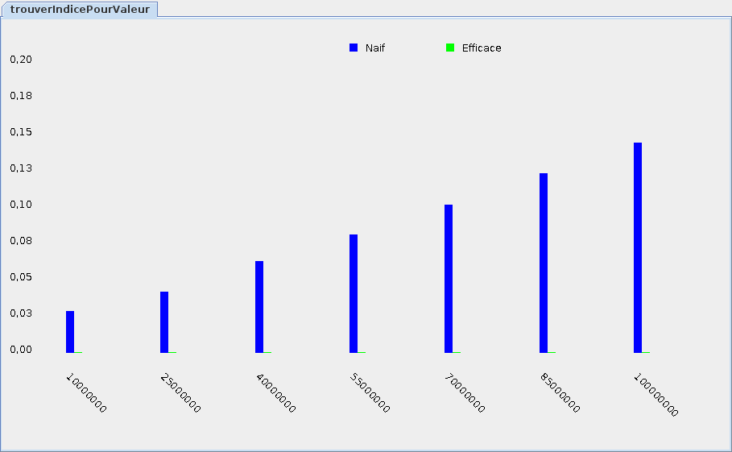
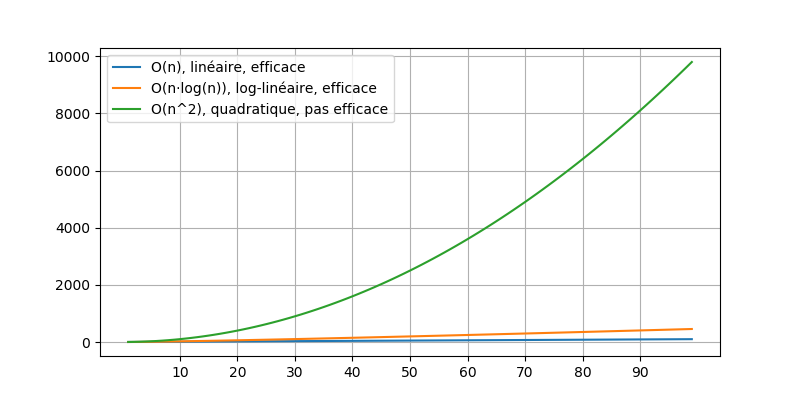
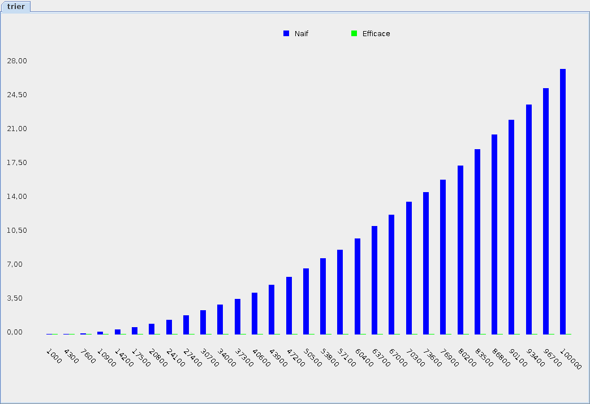

{}

* On peut estimer l'efficacité d'un programme en analysant son pseudo-code

* Nous allons utiliser les exemples suivants:
    * une recherche naïve: `O(n)`
    * un tri naïf: <code>O(n2)</code>
    * une recherche de type "diviser pour régner": `O(log(n))`
    * le tri fusion: `O(log(n)·n)`

## Estimer l'efficacité avec `O()`

* Il faut se poser la question:
    * pour chacun des `n` éléments en entrée: 
        * combien de fois est-ce que l'élément sera manipulé?

* Voici le pseudo-code d'un recherche naïve:

{}

* Clairement, on va manipuler chaque élément une fois:
    * on fait une boucle sur tout le tableau
    * on compare chaque élément du tableau à la valeur cherchée

* Donc, si on a `n` éléments en entrée, il y aura environs `n` instructions

* Donc, l'efficacité (complexité) de l'algorithme est estimée à `O(n)`

## Tri naïf: <code>O(n2)</code>

* Voici le pseudo-code d'un algorithme de tri naïf:

{}

* Si le tableau `entree` contient `n` éléments, la boucle va s'exécuter `n` fois
    * à chaque tour de boucle, on retire un élément
    * après `n` tours, `entree` sera vide et on va quitter la boucle

* On va faire au moins `n` appels à `valeurMinimale()`

* Le nombre d'instructions va être `n·VM`
    * où `VM` est le nombre d'instructions pour chaque appel à `valeurMinimale()`
    * le nombre d'instructions total est estimé à `O(n·VM)`

* Regardons le pseudo-code de `valeurMinimale()`:

{}

* On visite chaque élément du tableau
    * donc on va faire `n` instructions pour **chaque appel** à `valeurMinimale()`
    * alors `VM == n`

* En résumé:
    * la boucle de `trier` fait `n` appels à `valeurMinimale()` 
    * chaque appel à `valeurMinimale()` fait `n` instructions
    * on a donc `O(n·VM)` où `VM == n`
    * on a donc `O(n·n)`
    * on a donc <code>O(n2)</code>

* L'efficacité (complexité) de notre tri naïf est <code>O(n2)</code>

## Diviser pour régner: `O(log(n))`

* On cherche une valeur dans un tableau **trié** de plus petit au plus grand

* Est-ce qu'on est obligé de visiter tout le tableau?

* On peut appliquer une technique appelée "diviser pour régner":
    * on choisit un élément au milieu du tableau
    * si l'élément est plus petit que la valeur cherchée
        * on peut chercher uniquement "haut dessus" de cet élément
    * si au contraire l'élément est plus grand que la valeur cherchée
        * on peut chercher uniquement "en dessous" de cet élément

* Et pour chercher dans la moitié du tableau? 
    * on applique encore "diviser pour régner"
    * on cherche uniquement dans la moitié de la moitié du tableau

* Et ainsi de suite jusqu'à ce qu'on trouve

* À chaque étape dans notre recherche, on divise le tableau en deux

* Pour estimer le nombre d'instructions, on divise `n` par 2 à chaque étape de recherce:
    * si `n=2048`, on a:
        * éléments restants à visister après la 1ière étape: `2048`
        * éléments restants à visister après la 2ième étape: `1024`
        * éléments restants à visister après la 3ième étape: `512`
        * éléments restants à visister après la 4ième étape: `256`
        * éléments restants à visister après la 5ième étape: `128`
        * éléments restants à visister après la 6ième étape: `64`
        * éléments restants à visister après la 7ième étape: `32`
        * éléments restants à visister après la 8ième étape: `16`
        * éléments restants à visister après la 9ième étape: `8`
        * éléments restants à visister après la 10ième étape: `4`
        * éléments restants à visister après la 11ième étape: `2`
        * éléments restants à visister après la 12ième étape: `1`
    * on a terminé notre recherche en seulement `12` étapes
    * (en terme d'informatique, c'est ridiculement petit)

* Il s'agit de `O(log(n))`, le contraire d'une explosion exponentielle:

    

* Les algorithmes `O(log(n))` sont souvents les plus efficaces

* Par exemple, voici des résultats comparant nos deux recherches:

    

* Ce n'est pas une erreur si la ligne verte est presque invisible!
    * la recherche efficace est tellement rapide qu'on arrive à peine à la mesurer

## Tri fusion: `O(log(n)·n)`

* Est-ce qu'on peut appliquer l'idée de "diviser pour régner" au tri?

* Oui, voici par exemple le tri fusion:

{}

* À chaque étape, on fait un nouvel appel à `trier`
    * donc à chaque étape on divise `entree` en deux
    * il va donc avoir `log(n)` étapes
    * on va donc faire `log(n)` appels à `fusionner()`

* Chaque appel à `fusionner()` demande au moins `n` instructions
    * (chaque élément est manipulé une fois)

* L'efficacité (complexité) de l'algorithme est donc `O(log(n)·n)`
    * c'est à dire, on fait `log(n)` fois une étape qui demande `n` instructions

* En terme d'efficacité, les algorithmes `O(log(n)·n)` sont presques aussi bon que `O(n)`:

    

* Par exemple, voici une comparaison entre le tri naïf et le tri fusion:

    

* Encore une fois, ce n'est pas une erreur si la ligne verte est presque invisible!
    * en comparaison au tri naïf, le tri fusion est preque instantané
