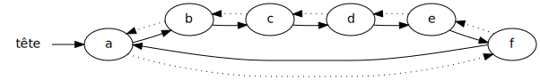
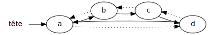
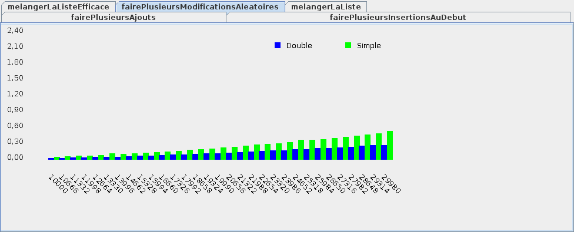

{}


## Liste chaînée double


* Dans une liste chaînée double, chaque élément pointe: 
    * vers l'élément suivant: <span style="font-size:300%">`→`</span>
    * vers l'élément précédent: <span style="font-size:300%">`⇢`</span>

<center>
    
</center>

* On peut donc accéder à la fin de la liste en reculant de 1 à partir de la tête
    * ci-haut, si on recule de 1 à partir de `a`, on arrive à `f` 

* Inconvénients:
    * plus difficile à implanter qu'une liste chaînée simple
    * il faut quand même faire une boucle pour obtenir un élément de la liste

* Avantages:
    * on peut chercher un élément *vers l'avant* ou *vers l'arrière*
    * l'insertion/retrait au début **et à la fin** est efficace
    * on ne consome pas d'espace mémoire en trop

## Exemple: ajouts dans liste chaînée double


<table>

<tr>
<td>
<code>liste<br>// []</code>
</td>
<td>

</td>
</tr>

<tr>
<td>
<code>liste.add('a')<br>// [a]</code>
</td>
<td>

</td>
</tr>

<tr>
<td>
<code>liste.add('b')<br>// [a,b]</code>
</td>
<td>

</td>
</tr>

<tr>
<td>
<code>liste.add('c')<br>// [a,b,c]</code>
</td>
<td>

</td>
</tr>

<tr>
<td>
<code>liste.add('d')<br>// [a,b,c,d]</code>
</td>
<td>

</td>
</tr>

</table>

## Liste chaînée double en Java


* Notre classe pour l'élément contient cette fois-ci:
    * la valeur
    * un pointeur vers l'élément suivant
    * un pointeur vers l'élément précédent

```java
{}
```

* La classe pour la liste est similaire:

```java
{}
```

* Pour modifier un élément, on fait une boucle:
    * soit en cherchant vers l'avant
        * (lorsque la position est proche du début)
    * soit en cherchant vers l'arrière
        * (lorsque la position est proche de la fin)

* Pour insérer, on peut soit:
    * insérer après un élément
    * insérer avant un élément

* P.ex. insérer à la fin de la liste équivaut à:
    * insérer avant la tête!


## Efficacité simple Vs double


* Pour ajouter à la fin:

<center>
    
</center>

* Pour retirer à la fin:

<center>
    
</center>


* Pour insérer au début:

<center>
    
</center>

* Pour retirer au début:

<center>
    
</center>


* Pour modifier au milieu:

<center>
    
</center>


