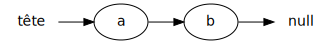

{}


* Une liste chaînée utilise des pointeurs (références), p.ex:

<center>
    
</center>

* Chaque noeud ci-haut est un objet qui contient une valeur

* Pour obtenir le prochain élément, on suit la référence (la flèche)

* Inconvénient:
    * il faut faire une boucle pour obtenir un élément de la liste

* Avantages:
    * l'insertion/retrait au début est efficace
    * on ne consome pas d'espace mémoire en trop

## Exemple: ajouts dans liste chaînée simple


<table>

<tr>
<td>
<code>liste<br>// []</code>
</td>
<td>

</td>
</tr>

<tr>
<td>
<code>liste.add('a')<br>// [a]</code>
</td>
<td>

</td>
</tr>

<tr>
<td>
<code>liste.add('b')<br>// [a,b]</code>
</td>
<td>

</td>
</tr>

<tr>
<td>
<code>liste.add('c')<br>// [a,b,c]</code>
</td>
<td>

</td>
</tr>

</table>

## Liste chaînée simple en Java


* Il faut une classe pour représenter un élément:
    * l'élément contient la valeur et un pointeur vers l'élément suivant

```java
{}
```


* Et une classe pour la liste:
    * on mémorise la tête et la taille

```java
{}
```
    
* Pour modifier un élément, il d'abord le trouver avec une boucle

