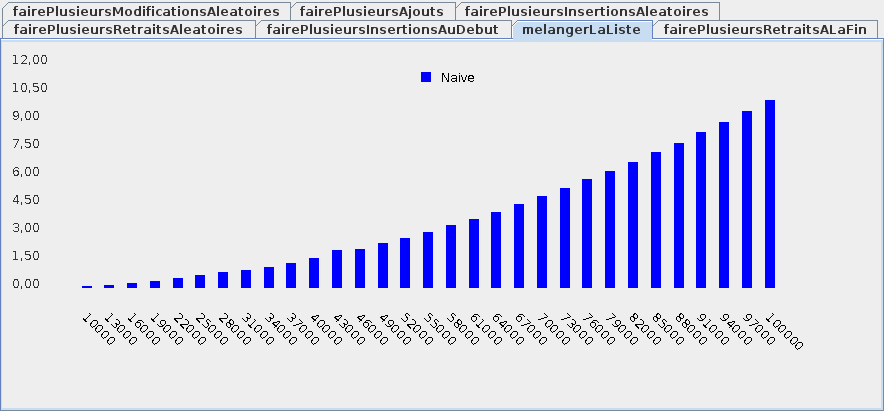
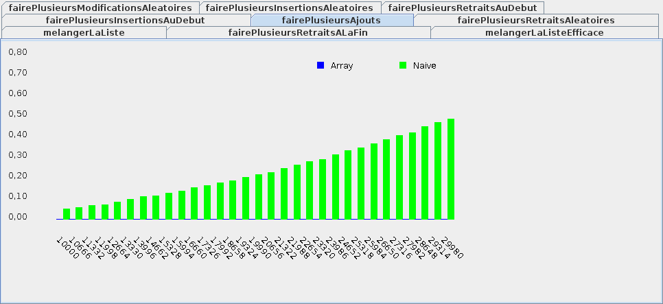
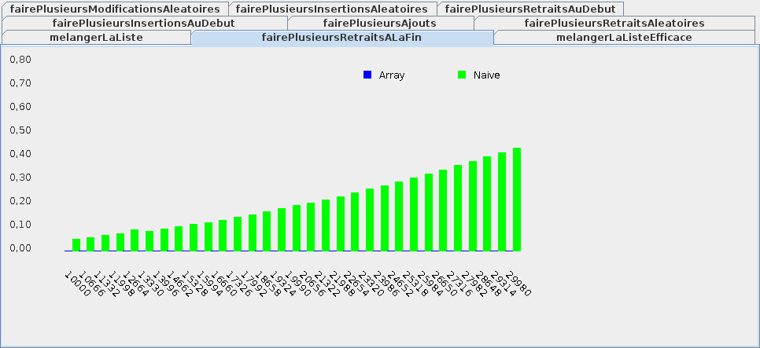
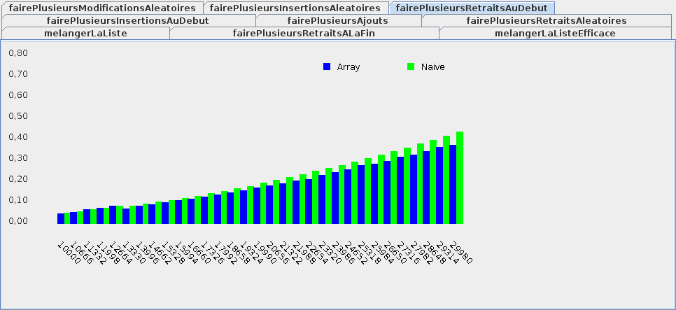
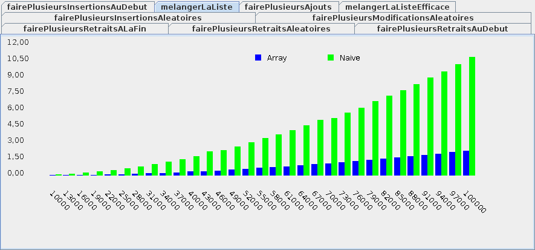
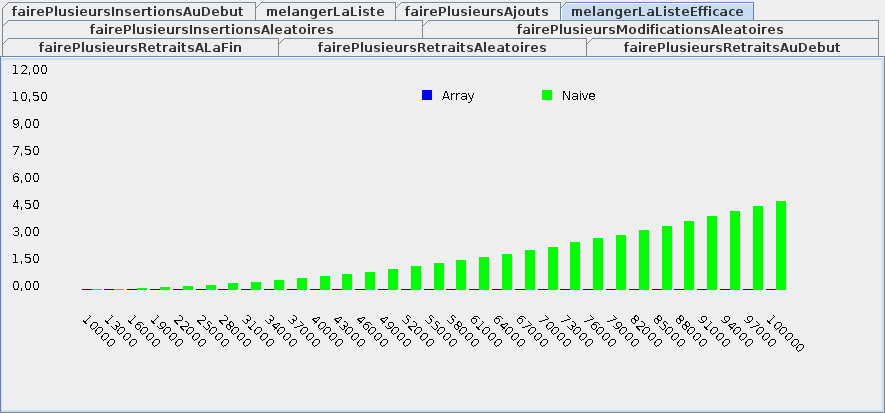

{}


* Une liste est un tableau qui peut grandir et rapetisser

```java
{}
```

* Comment implanter une liste de façon efficace?

* Ça dépend. Efficace pour quelle opération?:
    * la modification d'éléments existants? (module 5.1)
    * l'ajout et le retrait de nouveaux éléments? (module 5.2)


## `O(1)`: temps constant


* Quand on a parlé d'efficacité, on a définit:
    * Efficace:
        * `O(log(n))`: temps logarithmique
        * `O(n)`: temps linéaire
    * Pas efficace:
        * <code>O(n<sup>2</sup>)</code>: temps quadratique
        * <code>O(2<sup>n</sup>)</code>: temps exponentiel

* Il faut ajouter:
    * Efficace:
        * `O(1)`: temps constant
            * le nombre d'instructions ne dépend pas de la taille des données

* Accéder à une valeur dans un tableau se fait en temps contant:

```java
{}
```

* Même chose pour modifier une valeur dans un tableau:

```java
{}
```

## Liste par tableau naïve

* Le plus simple est de mémoriser les éléments de la liste dans un tableau

```java
{}
```

* La modification d'un élément existant se fera en temps constant

```java
{}
```

* Pour ajouter un nouvel élément, c'est plus compliqué:

```java
{}
```

* Pour ajouter un élément, il faut:
    * créer un nouveau tableau plus grand d'un emplacement
    * copier les éléments existants dans le nouveau tableau
    * mémoriser le nouvel élement dans le nouvel emplacement

* L'opération se fait en temps linéaire `O(n)`

* Le problème est que `add` est typiquement utilisé dans une boucle

* P.ex. pour mélanger une liste:

```java
{}
```

* On a une boucle qui visite les éléments de `entree` 
    * si chaque `add` requiert une autre boucle sur les éléments
    * on va avoir une boucle dans une boucle et donc <code>O(n<sup>2</sup>)</code>

    <center>
    
    </center>

## Liste par tableau plus efficace


* Si on veut être plus efficace, il faut éviter de toujours recopier les éléments

* Une façon de faire est d'utiliser un tableau plus grand 

```java
{}
```

* Quand on ajoute un élément, on peut simplement mémoriser que la liste grandit

```java
{}
```

```java
{}
```

* Évidemment, il faudra parfois faire grandir le tableau aussi:

```java
{}
```

* Néanmoins, `add` est beaucoup plus efficace:

    <center>
    
    </center>

* Ainsi que retirer à la fin:

    <center>
    
    </center>

* C'est un exemple de compromis temps/espace mémoire 
    * en utilisant plus d'espace mémoire, on améliore le temps d'exécution


* Par contre, retirer au début est presqu'identique:

    <center>
    
    </center>

## Exemples 


### Ajouts à partir d'une liste vide

<table>
<tr>
<td>
<code>liste</code>
</td>
<td>
<code>[null,null,null,...,null]</code>
<br>
<code>indiceDernierElement == -1</code>
</td>
</tr>

<tr>
<td>
<code>liste.add('a')</code>
</td>
<td>
<code>[a,null,null,...,null]</code>
<br>
<code>indiceDernierElement == 0</code>
</td>
</tr>

<tr>
<td>
<code>liste.add('b')</code>
</td>
<td>
<code>[a,b,null,...,null]</code>
<br>
<code>indiceDernierElement == 1</code>
</td>
</tr>

</table>

### Un retrait au milieu

<table>

<tr>
<td>
<code>liste</code>
</td>
<td>
<code>[a,b,c,d,e,null,...,null]</code>
<br>
<code>indiceDernierElement == 4</code>
</td>
</tr>

<tr>
<td>
<code>liste.remove('c')</code>
</td>
<td>
<code>[a,b,<strong>d</strong>,d,e,null,...,null]</code>
<br>
<code>[a,b,d,<strong>e</strong>,e,null,...,null]</code>
<br>
<code>indiceDernierElement == 3</code>


</td>
</tr>


</table>


## Implanter un mélangeur effiace


* Re-considérer notre mélangeur:

```java
{}
```

* L'efficacité du mélangeur est améliorée:

    <center>
    
    </center>

* Mais on peut faire mieux!

* Comment modifier notre mélangeur pour ne pas utiliser `remove`?

* On pourrait alors avoir:

    <center>
    
    </center>

* Pour écrire du code effiace, il faut:
    * savoir quelles opérations sont coûteuses sur notre structure de données
