{}

* On peut implanter un map avec un arbre binaire de recherche

* Il faut que chaque noeud soit une paire

* Considérer le map `{0:'w', 1:'h', 2:'t', 3:'d', 4:'a', 5:'z', 6:'h'}`

* Voici l'arbre avec uniquement les clés:

    

        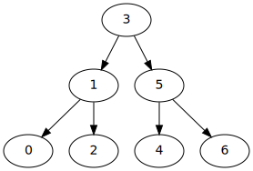
    

    * RAPPEL:
        * chaque noeud a au plus deux enfants
        * à gauche il y a toujours des valeurs plus petites
        * à droite il y a toujours des valeurs plus grandes

* Pour faire un map, il faut mémoriser des paires clé/valeur
    * mais quand même chercher avec la clé

    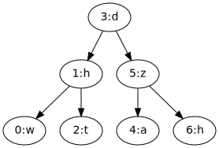

* Donc, on va:
    * trouver un noeud en cherchant la clé
    * une fois le noeud trouvé, on va obtenir ou modifier la valeur

## Problème d'efficacité

* Pour que la recherche soit efficace, il faut que l'arbre soit équilibré
    * c-à-d l'abre doit être aussi gros à gauche qu'à droite
    * comme ça on peut utiliser l'approche «diviser pour régner»
        * c-à-d diviser la recherche en deux à chaque étape

* Par exemple, l'arbre suivant est valide, mais ne permet pas de recherche efficace:

    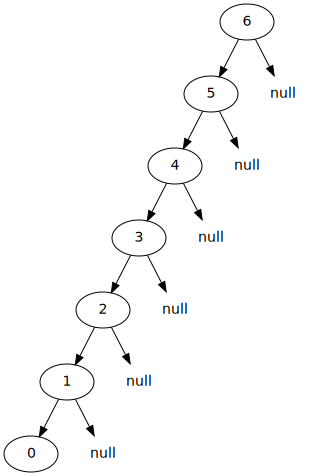

* Dans le cas ci-haut, la recherche n'est pas plus effiace que pour une liste chaînée

## S'assurer d'avoir des arbres équilibrés

* Selon l'ordre d'insertion, l'arbre sera équilibré ou non.

* Si on insère `3,1,5,0,2,4,6`, l'arbre est équilibré:

<table>

<tr>
<td>
<code>arbre.inserer(3)</code>
</td>
<td>
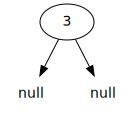
</td>
</tr>

<tr>
<td>
<code>arbre.inserer(1)</code>
</td>
<td>

</td>
</tr>

<tr>
<td>
<code>arbre.inserer(5)</code>
</td>
<td>
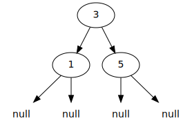
</td>
</tr>

<tr>
<td>
<code>arbre.inserer(0)</code>
</td>
<td>
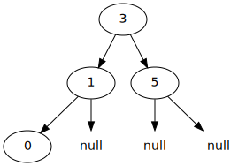
</td>
</tr>

<tr>
<td>
<code>arbre.inserer(2)</code>
</td>
<td>
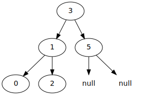
</td>
</tr>

<tr>
<td>
<code>arbre.inserer(4)</code>
</td>
<td>
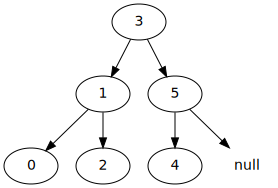
</td>
</tr>

<tr>
<td>
<code>arbre.inserer(6)</code>
</td>
<td>

</td>
</tr>

</table>

* Mais si on insère `6,5,4,3,2,1,0`, l'arbre est complétement déséquilibré

<table>

<tr>
<td>
<code>arbre.inserer(6)</code>
</td>
<td>
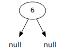
</td>
</tr>

<tr>
<td>
<code>arbre.inserer(5)</code>
</td>
<td>
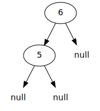
</td>
</tr>

<tr>
<td>
<code>arbre.inserer(4)</code>
</td>
<td>
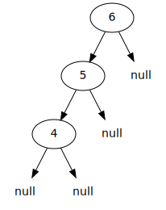
</td>
</tr>

<tr>
<td>
<code>arbre.inserer(3)</code>
</td>
<td>
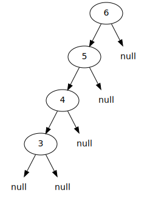
</td>
</tr>

<tr>
<td>
<code>arbre.inserer(2)</code>
</td>
<td>
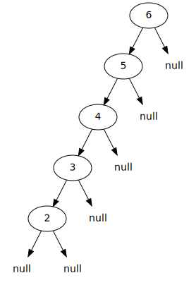
</td>
</tr>

<tr>
<td>
<code>arbre.inserer(1)</code>
</td>
<td>
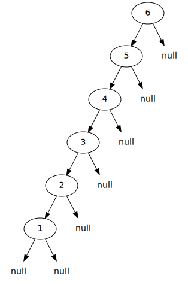
</td>
</tr>

<tr>
<td>
<code>arbre.inserer(0)</code>
</td>
<td>

</td>
</tr>

</table>

* Évidement, on a pas de contrôle sur l'ordre d'insertion des éléments

* La solution est de ré-équilibrer l'arbre après chaque insertion

<table>

<tr>
<td>
<code>arbre.inserer(3)</code>
</td>
<td>

</td>
</tr>

<tr>
<td>
<code>arbre.inserer(1)</code>
</td>
<td>
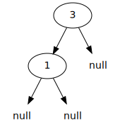
</td>
</tr>

<tr>
<td>
<code>arbre.inserer(0)</code>
</td>
<td>
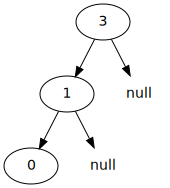
</td>
</tr>

<tr>
<td>
<code>arbre.equilibrer()</code>
</td>
<td>
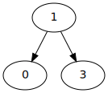
</td>
</tr>

</table>

* L'opération pour équilibrer l'arbre est appelée une rotation
    * p.ex. pour l'arbre ci-haut:
        * le `3` tourne vers la droite et descend
        * le `1` tourne vers la droite et monte
        * le `0` tourne vers la droite et suit le `1`

* Si on équilibre à chaque insertion, ce n'est pas coûteux en temps
    * c'est par contre délicat à coder

## Performance en pratique

* En général, un peu moins bon qu'une table de hachage

* Mais prend moins d'espace mémoire

    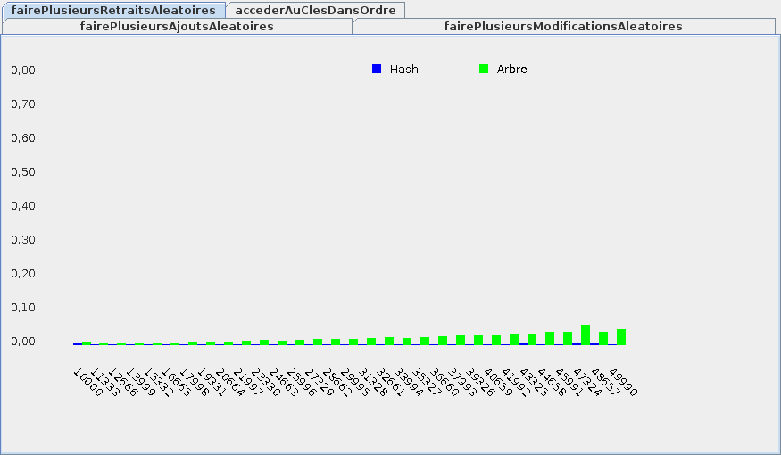

* RAPPEL: l'efficacité de la table de hachage peut varier selon la taille de la table et la fonction de hachage

