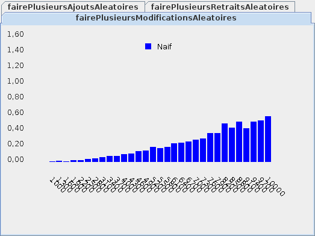
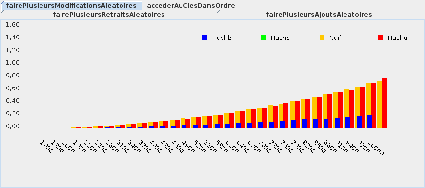

{}


* Un map permet d'associer une clé à une valeur
    * chaque clé est unique

* Par exemple, le map ci-bas associe la clé `"xdf"` à la valeur `12`:
    * `{"sdx":5,"xdf":12,"lkm":54}`


* Un map est aussi appelé: dictionnaire, liste associative, objet JSON

* On peut voir un map comme un tableau où les indices ne sont **pas** des entiers:

```java
{}
```


## Interface d'un map

```java
{}
```

## Implantation naïve d'un map


* On utilise deux listes:
    * la liste des clés
    * la liste des valeurs

* Une paire clé/valeur est mémorisée au même indice

* Par exemple:

    * Si la clé `"xdf"` est à l'indice `1` dans `cles`
    * Alors la valeur associée à `"xdf"` est aussi à l'indice 1, mais dans `valeurs`

```java
{}
```


* En général:

```java
{}
```


* Chaque clé doit héritée de la classe `Cle`:

    * on veut ainsi rendre explicite la notion de clé

```java
{}
```


## Problème d'efficacité


* Modifier une valeur dans notre map naïf n'est pas efficace:

<center>
    
</center>

* Le problème est que `indexOf` fait une boucle sur la liste des clés

* Mais on aimerait que ça soit efficace:
    * on veut utiliser le map comme un tableau

## Fonction et table de hachage


* On veut éviter de chercher l'indice de la clé avec un `indexOf`

* On utiliser une fonction de hachage, c-à-d une méthode qui va
    * calculer un indice pour chaque clé
    * sans chercher d'information sur les autres clés

* Une clé hachable doit implanter la méthode `indice` qui retourne l'indice de la clé

```java
{}
```


* Voici par exemple une clé hachable quand la clé est une chaîne:

    * l'indice est simplement la longueur de la clé

```java
{}
```


* Une fois qu'on a un indice, on peut mémoriser la valeur dans un tableau

```java
{}
```

* IMPORTANT: la fonction de hachage ne doit **pas** être aléatoire
    * sinon on ne peut plus retrouver une valeur mémorisée par indice!

## Quoi faire en cas de collision?


* Quoi faire s'il y a une collision, c-à-d si deux clés ont le même indice?

```java
{}
```

* En fait, on ne peut pas associer un indice directement à une valeur

* Il faut plutôt associer l'indice à un map naïf:

```java
{}
```

* S'il n'y a pas souvent de collision:
    * on accède aux valeurs **surtout** par indice 
    * le map naïf associé à l'indice va contenir très peu de valeurs
    * c'est alors efficace

* Au contraire, s'il y beaucoup de collisions:
    * on accède presque toujours aux mêmes indices
    * le map naïf associé à un indice va contenir beaucoup de valeurs
    * on accède donc aux valeurs **surtout** en cherchant la clé
    * c'est alors inefficace

* Donc, une *bonne fonction de hachage* doit:
    * retourner le plus souvent possible un indice différent
    * retourner toujours le même indice pour la même clé (ne pas être aléatoire)

## Implantation d'un map avec hachage


* Voici le début de l'implantation

```java
{}
```

* IMPORTANT: 
    * la méthode `CleHachable.indice` peut retourner un indice `>= table.length`
    * il faut adapter l'indice à la table de notre tableau
    * habituellement, on fait ça avec l'opérateur modulo `%`


## Efficacité


* L'efficacité dépend du nombre de collisions, ce qui dépend en fait de:
    * la taille de la table de hachage 
    * la qualité de la fonction de hachage

* On a encore le compromis temps/espace mémoire:
    * pour obtenir plus d'efficacité en temps, on va utiliser plus d'espace mémoire
    
* Exemple:

<center>
    
</center>

* La fonction `Hashc` est très efficace, alors que
    * `Hashb` est un peu efficace 
    * `Hasha` équivaut à l'implantation naïve
