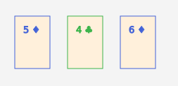
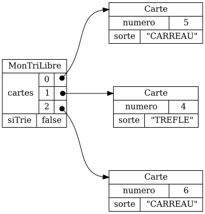
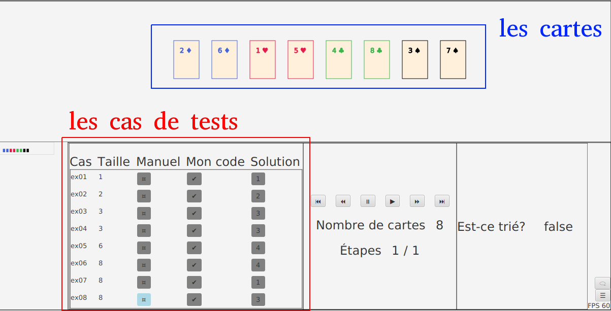
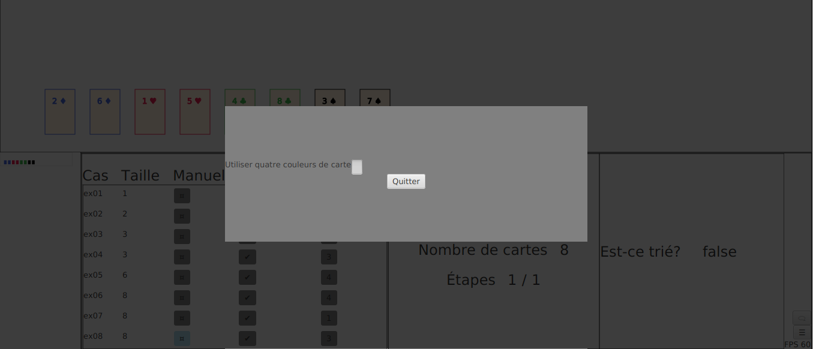

{}


## Notion de modèle

1. Un modèle est une classe qui représente des données importantes pour un programme

1. Prenons par exemple un petit tableau de cartes issu de l'atelier 1.1&nbsp;:

    

    


1. Le modèle est la classe `MonTriLibre`

1. Il faut aussi les objets `Carte` pour bien représenter les données

1. Les classes complémentaires comme `Carte` sont parfois appelées des valeurs (ou des sous-modèles)

## Un modèle a des comportements (méthodes)

1. Comme `MonTriLibre` est une classe, le modèle contient aussi des méthodes

1. Par exemple&nbsp;:

    * `boolean isSorted` pour déterminer si les cartes sont triées
    * `int testCaseSize` qui retourne la taille de l'exemple (le nombre de cartes)

1. La valeur `Carte` contient aussi des méthodes, par exemple&nbsp;:

    * `int compareTo` pour indiquer si la carte est plus petite qu'une autre carte
    * `boolean isNullCard` pour indier s'il s'agit vraiment d'une carte ou d'une case vide

1. On va voir à la session suivante qu'une application graphique est souvent divisée en trois parties&nbsp;:

    * **le modèle**&nbsp;: contient les données et les méthodes pour manipuler les données
    * **la vue**&nbsp;: contient le code pour afficher les données
    * **le contrôleur**&nbsp;: contient le code pour créer les vues et les modèles et autres tâches


## Une application a souvent plusieurs modèles


1. Par exemple, l'outil de validation a un modèle a trois modèles


    * un modèle pour les cartes et un pour les cas de tests

    

    * un modèle pour des paramètres

    


## Modèle en JSON


1. JSON n'a pas de notion de classe

1. Dans ce cours, on va utiliser la clé spéciale `_C` pour identifier la classe

1. On a donc la représentation JSON suivante pour un 4♧&nbsp;:

    ```json
    {
        "_C": "Carte",
        "numero": 4,
        "sorte": "TREFLE"
    }
    ```

1. Et le JSON suivant pour une liste de trois cartes


    

    ```json
    [
        {
            "_C": "Carte",
            "numero": 5,
            "sorte": "CARREAU"
        },
        {
            "_C": "Carte",
            "numero": 4,
            "sorte": "TREFLE"
        },
        {
            "_C": "Carte",
            "numero": 6,
            "sorte": "CARREAU"
        }
    ]
    ```


1. Et finalement le JSON suivant pour le modèle `MonTriLibre`


    

```json
{}
```


