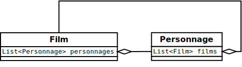
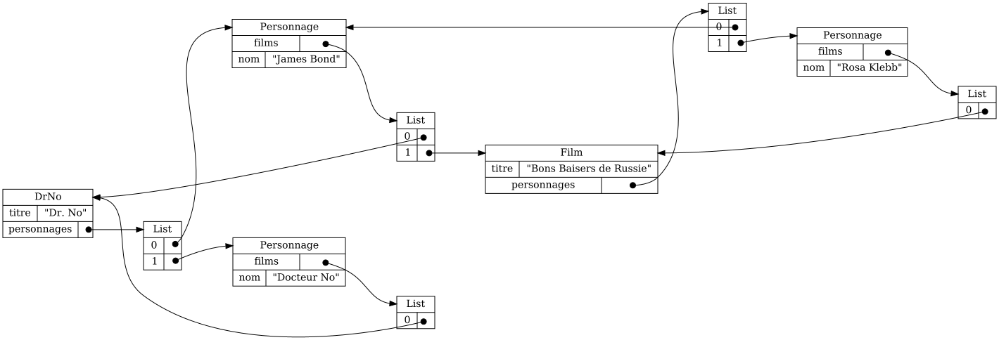

{}

{}

1. Un modèle Java contient des références

    

    * Un `Personnage` apparaît dans plusieurs `Film`
    * Un `Film` contient plusieurs `Personnage`

1. Très souvent, ces références forment des boucles

    

    * Le `Personnage` James Bond apparaît dans deux films: Dr. No et Bon Baisers de Russie
    * Le `Film` Dr. No contient deux personnages: James Bond et Dr. no

1. On parle alors de graphe d'objets (plutôt que de tableau d'objets)


## Graphe d'objets en JSON

{}

1. JSON n'a pas de notion de référence

1. Dans ce cours, on ajoute un objet spécial `{"_R":"/chemin/vers/objet/cible"}` pour représenter certaines références

    * (sans l'objet spécial, on ne peut pas représenter les boucles)

1. Par exemple, le graphe ci-haut est représenté comme suit en JSON

```json
{}
```


NOTE:

* on ne va pas vous demander d'écrire du JSON avec l'objet spécial `{"_R":"/chemin/cible"}`
* il vous faut uniquement comprendre que ça existe 
* et comprendre la notion de graphe d'objets en POO



