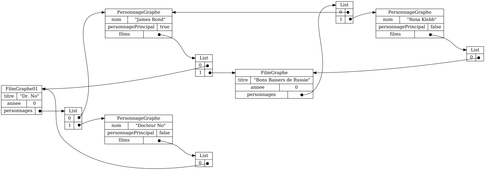
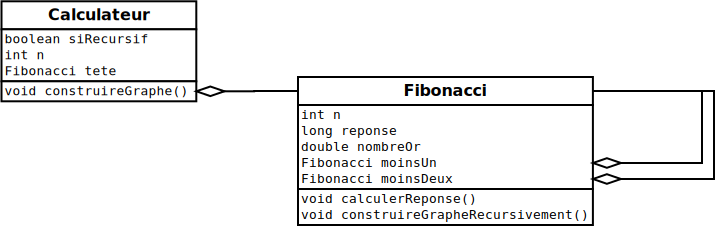
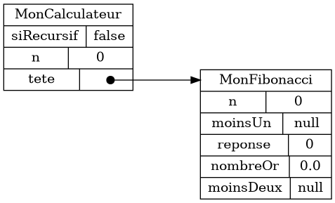
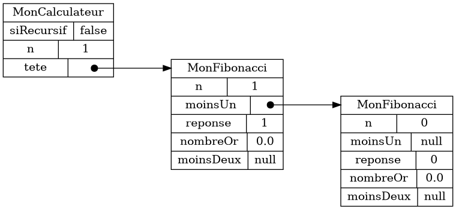
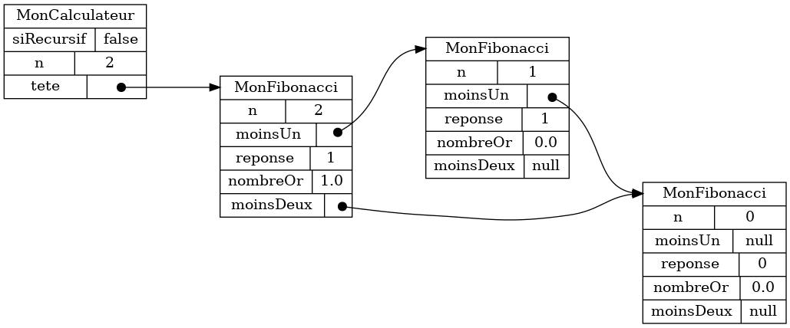
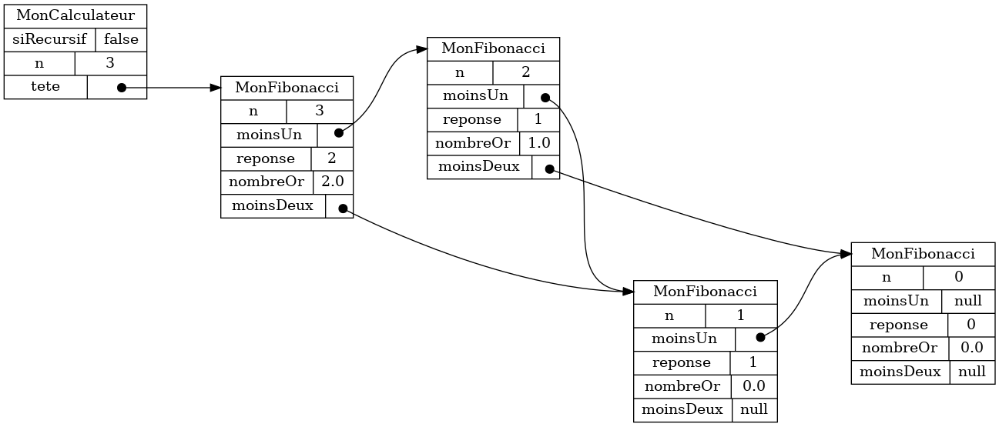

{}

Dans le cas général, des données orientée-objet forme un graphe.

## Graphe film/personnage

On peut compléter ainsi la modélisation des films et des personnages présentées aux chapitres précédents.


* Un `Personnage` apparaît dans plusieurs `Film`
* Un `Film` contient plusieurs `Personnage`

Voici un exemple de données se conformant à cette modélisation.



* Le `Personnage` James Bond apparaît dans deux films&nbsp;: *Dr. No* et *Bon Baisers de Russie*
* Le `Film` Dr. No contient deux personnages&nbsp;: James Bond et Dr. No

## Exemple&nbsp;: Fibonacci

Dans le cas général, il n'est pas facile de visualiser un graphe d'objet avec des cartes.
Dans notre approche, il est donc nécessaire de s'en tenir à des cas particuliers.
Comme exemple, nous développons une modélisation de la séquence de Fibonacci.

## Définition

Voici le début de la suite de Fibonacci&nbsp;:

```
0 1 1 2 3 5 8 13 21 34 55 89 144 ...
```

La définition mathématique est récursive&nbsp;:

    
    F_0 = 0\\~\\

    F_1 = 1\\~\\

    F_n = F_{n-1} + F_{n-2}\\~\\
    

Autrement dit&nbsp;:

* `0` et `1` sont deux cas spéciaux

* sinon le prochain nombre de la suite est toujours l'addition deux nombres précédents

## Nombre d'or

1. La suite de Fibonacci est utilisée pour calculer le <a target="_blank" href="https://fr.wikipedia.org/wiki/Nombre_d'or">nombre d'or</a>, soit environs `1.618`

    * (le nombre d'or est reconnu, entre autres choses, comme une proportion hauteur/largeur agréable à l'oeil)

1. Comme pour π, on peut le calculer le nombre d'or avec autant que précision que désiré

    * (c.-à-d. avec autant de chiffres après le point que désiré)

1. Pour calculer une approximation du nombre d'or on fait tout simplement&nbsp;:

    
    \text{nombre d'or} \approx \dfrac{F_{n}}{F_{n-1}} \text{~~~pour~~~} n\geq 2
    

1. Plus on prend un `n` élevé, plus la précision est bonne

1. Autrement dit, le nombre d'or est à peu près égal à&nbsp;:

    * un nombre de la suite de Fibonacci, divisé par le nombre qui le précède

    * (plus on prend un nombre loin dans la suite, plus l'approximation est bonne)


## Modéliser la suite de Fibonacci

1. Pour modéliser la suite en Java, on va créer une structure de données récursive

<center>

</center>


1. Pour `n = 0`, on a le graphe d'objets suivant

    

1. Pour `n = 1`, on a le graphe d'objets suivant

    

1. Pour `n = 2`, on a le graphe d'objets suivant

    

    * NOTE&nbsp;: la suite se lit de droite à gauche

1. Pour `n = 3`, on a le graphe d'objets suivant

    

1. Et ainsi de suite...

## Pour calculer la réponse et le nombre d'or

1. Calculer la réponse pour `n >= 2` est simple

    ```java
    reponse = moinsUn.getReponse() + moinsDeux.getReponse();
    ```

1. Même chose pour le nombre d'or

    ```java
    nombreOr = Double.valueOf(reponse) / Double.valueOf(moinsUn.getReponse());
    ```

1. Le défi est qu'il faut d'abord construire le graphe d'objet


## Construire le graphe d'objets récursivement

1. Avec des appels récursifs, on va construire d'abord, puis calculer

    {{% animation src="/modelisation/graphe_d_objets/calcul_recursif.webm" width="100%" %}}

    * on crée d'abord l'objet `n`, puis `n-1`, et ainsi de suite jusqu'à l'objet `0`

1. Pour le cas `n >= 2`, voici comment procéder

    * créer un nouvel objet `MonFibonacci` et le mémoriser dans `moinsUn`

    * enregistrer que le `n` de ce `moinsUn` est `n-1` (le `n` courant moins `1`)

    * créer le reste du graphe récursivement en appelant `moinsUn.construireGrapheRecursivement()`

    * enregister que le `moinsDeux` courant est `moinsUn.getMoinsUn()` (le `moinsUn` du `moinsUn` courant)

    * calculer la réponse courante à partir des réponses de `moinsUn` et `moinsDeux`

1. L'appel récursif est plus proche de la définition mathématique

    * (pour calculer la réponse en `n`, il faut d'abord calculer la réponse en `n-1`)

1. L'inconvénient est qu'on peut déborder la pile d'appel

    ```
    Exception in thread "main" java.lang.StackOverflowError
        at ca.ntro.cards.fibonacci.solution.MonFibonacci.construireGrapheRecursivement(MonFibonacci.java:31)
        at ca.ntro.cards.fibonacci.solution.MonFibonacci.construireGrapheRecursivement(MonFibonacci.java:31)
        at ca.ntro.cards.fibonacci.solution.MonFibonacci.construireGrapheRecursivement(MonFibonacci.java:31)
        at ca.ntro.cards.fibonacci.solution.MonFibonacci.construireGrapheRecursivement(MonFibonacci.java:31)
        at ca.ntro.cards.fibonacci.solution.MonFibonacci.construireGrapheRecursivement(MonFibonacci.java:31)
        at ca.ntro.cards.fibonacci.solution.MonFibonacci.construireGrapheRecursivement(MonFibonacci.java:31)
        at ca.ntro.cards.fibonacci.solution.MonFibonacci.construireGrapheRecursivement(MonFibonacci.java:31)
        at ca.ntro.cards.fibonacci.solution.MonFibonacci.construireGrapheRecursivement(MonFibonacci.java:31)
        at ca.ntro.cards.fibonacci.solution.MonFibonacci.construireGrapheRecursivement(MonFibonacci.java:31)
        at ca.ntro.cards.fibonacci.solution.MonFibonacci.construireGrapheRecursivement(MonFibonacci.java:31)
        at ca.ntro.cards.fibonacci.solution.MonFibonacci.construireGrapheRecursivement(MonFibonacci.java:31)
        at ca.ntro.cards.fibonacci.solution.MonFibonacci.construireGrapheRecursivement(MonFibonacci.java:31)
        ...
    ```

    * RAPPEL&nbsp;: le code n'est pas bogué, mais limité par la mémoire attribuée à la pile d'appel

## Construire le graphe d'objets dynamiquement


1. En programmation dynamique, on calcule en même temps qu'on construit

    {{% animation src="/modelisation/graphe_d_objets/calcul_dynamique.webm" width="100%" %}}

    * on crée d'abord l'objet `0`, puis `1`, et ainsi de suite jusqu'à l'objet `n`

1. L'idée est qu'on fait une boucle pour créer le graphe d'objets

    * on crée une `nouvelleTete` 

    * le `moinsUn` de la `nouvelleTete` est l'ancienne `tete`

    * le `moinsDeux` de la `nouvelleTete` est le `moinsUn` de l'ancienne `tete`

    * c.-à-d. on insère la `nouvelleTete` à gauche, et on «&nbsp;pousse&nbsp;» les objets existants vers la droite
    
1. Pour le cas `n >= 2`, voici comment procéder

    * pour chaque `i` allant de `2` à `n` (inclusivement)

        * créer un nouvel objet `MonFibonacci` pour représenter la `nouvelleTete`

        * enregistrer que le `n` de la `nouvelleTete` est `i`

        * enregistrer que le `moinsUn` de la `nouvelleTete` est la `tete` courante

        * enregistrer que le `moinsDeux` de la `nouvelleTete` est le `moinsUn` de la `tete` courante

        * enregistrer que `tete` pointe maintenant vers la `nouvelleTete`

        * calculer la réponse pour `tete`

1. Le calcul dynamique est moins intuitif (et moins proche de la définition mathématique), mais

    * on a éliminé l'appel récursif, alors on ne peut plus déborder la pile d'appel

