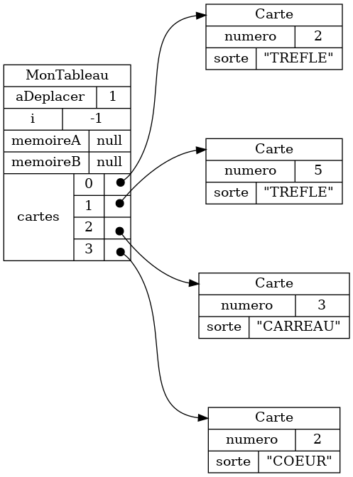
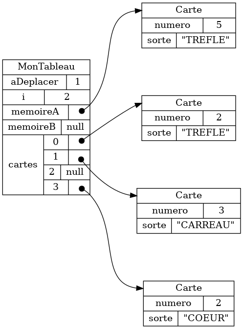
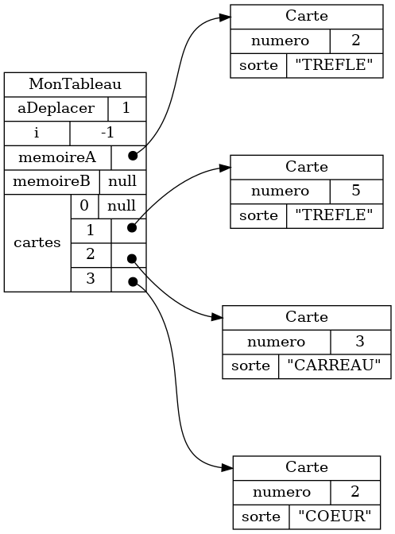
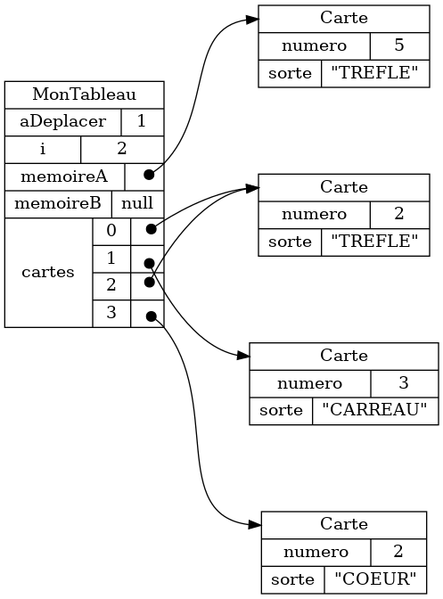
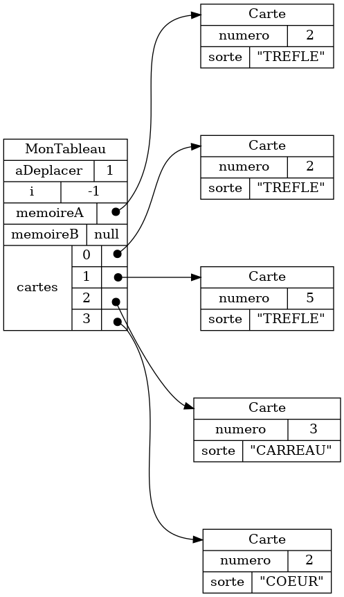

{}


## Visualiser les objets

{{% video 
    src="/3c6/etape1/module3/theorie/dessiner_tableau/tableau01.webm" 
    width="50%"
    %}}

### Exemple 1




### Exemple 2




## Comprendre l'effet d'instructions typiques

### Accéder à une valeur

{{% video 
    src="/3c6/etape1/module3/theorie/dessiner_tableau/tableau02.webm" 
    width="50%"
    %}}

#### Example 1

<table>
<tr>
<th>Objets au départ</th>
<th>Instructions</th>
<th>Résultat</th>
</tr>

<tr>
<td>

</td>
<td>

```java
memoireA.getNumero();
memoireA.getSorte();
```

</td>
<td>

```java
5
"TREFLE"
```


</td>
</tr>
</table>

#### Example 2

<table>
<tr>
<th>Objets au départ</th>
<th>Instructions</th>
<th>Résultat</th>
</tr>

<tr>
<td>

</td>
<td>

```java
cartes[2].getNumero();
cartes[2].getSorte();
```

</td>
<td>

```java
3
"CARREAU"
```


</td>
</tr>
</table>

#### Example 3

<table>
<tr>
<th>Objets au départ</th>
<th>Instructions</th>
<th>Résultat</th>
</tr>

<tr>
<td>

</td>
<td>

```java
cartes[2].getNumero();
memoireB.getNumero();
```

</td>
<td>

```java
java.lang.NullPointerException
java.lang.NullPointerException
```


</td>
</tr>
</table>


### Déplacer un objet (déplacer une carte)


{{% video 
    src="/3c6/etape1/module3/theorie/dessiner_tableau/tableau03.webm" 
    width="50%"
    %}}

#### Exemple 1

<table>
<tr>
<th>Objets au départ</th>
<th>Instruction</th>
<th>Résultat</th>
</tr>

<tr>
<td>

</td>
<td>

```java
memoireA = cartes[0];
cartes[0] = null;
```

</td>
<td>

</td>
</tr>
</table>

#### Exemple 2

<table>
<tr>
<th>Objets au départ</th>
<th>Instruction</th>
<th>Résultat</th>
</tr>

<tr>
<td>

</td>
<td>

```java
cartes[2] = cartes[0];
cartes[0] = null;
```

</td>
<td>

</td>
</tr>
</table>

### Copier la référence à un objet

{{% video 
    src="/3c6/etape1/module3/theorie/dessiner_tableau/tableau04.webm" 
    width="50%"
    %}}

#### Exemple 1

<table>
<tr>
<th>Objets au départ</th>
<th>Instruction</th>
<th>Résultat</th>
</tr>

<tr>
<td>

</td>
<td>

```java
memoireA = cartes[0];
```

</td>
<td>

</td>
</tr>

</table>

#### Exemple 2

<table>
<tr>
<th>Objets au départ</th>
<th>Instruction</th>
<th>Résultat</th>
</tr>

<tr>
<td>

</td>
<td>

```java
cartes[2] = cartes[0];
```

</td>
<td>

</td>
</tr>
</table>


### Créer un nouvel objet (créer une nouvelle carte)

{{% video 
    src="/3c6/etape1/module3/theorie/dessiner_tableau/tableau05.webm" 
    width="50%"
    %}}

#### Exemple 1

<table>
<tr>
<th>Objets au départ</th>
<th>Instruction</th>
<th>Résultat</th>
</tr>


<tr>
<td>

</td>
<td>

```java
memoireA = new Carte(2, "TREFLE");
```

</td>
<td>

</td>
</tr>

</table>

#### Exemple 2

<table>
<tr>
<th>Objets au départ</th>
<th>Instruction</th>
<th>Résultat</th>
</tr>


<tr>
<td>

</td>
<td>

```java
memoireB = new Carte(5, "TREFLE");
```

</td>
<td>

</td>
</tr>

</table>

