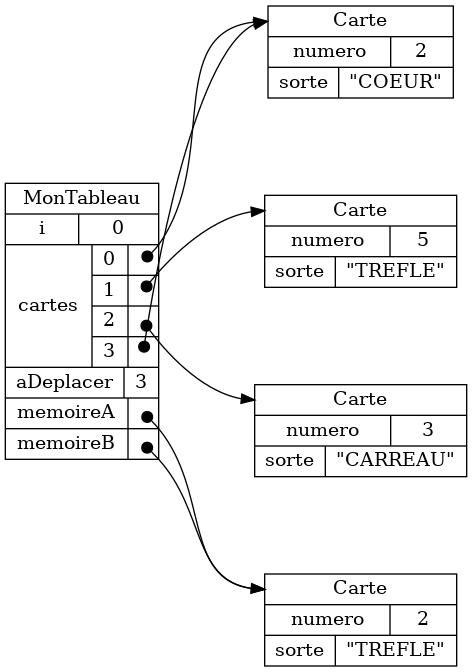

{}

{{% video 
    src="/3c6/etape1/module3/theorie/references_multiples/presentation.webm" 
    width="50%"
%}}

Typiquement, on va copier une référence à un objet, plutôt que déplacer l'objet.

<table>
<tr>
<th>
Typique
</th>
<th>
Plus rare
</th>
</tr>

<tr>
<td>

```java
memoireA = cartes[0];
```

</td>
<td>

```java
memoireA = cartes[0];
cartes[0] = null;
```

</td>
</tr>
</table>

Le résultat est qu'on a des références multiples: plusieurs références vers le même objet.


Si on visualise du code typique avec les cartes, on va visualiser les références multiples en affichant plusieurs copies d'une carte.

{}

La visualisation est correcte, mais plus difficile à lire.





Autant que possible, on va expliquer les procédures en déplaçant les cartes, 
c'est-à-dire
en évitant de créer des références multiples.
Cependant, il faut garder en tête que le code typique contient très souvent des références multiples.


