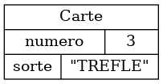
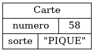
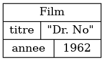
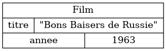
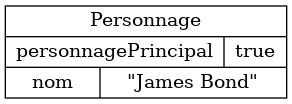
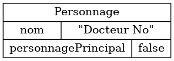
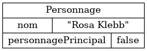

{}

L'unité de base d'un modélisation orientée-objet est l'objet.  Nous donnons ici
quelques exemples de modélisations, tout en discutant de la possibilité de
visualiser ces données avec des cartes à jouer.

## Modéliser une carte

Une carte est modélisée par la classe suivante:


L'attribut de type `Sorte` correspond à une énumération:

```java
{}
```

Voici quelques exemples de cartes.


<table>

<tr>
<td>

</td>
<td>

```json
{}
```

</td>
<td>

</td>
</tr>


<tr>
<td>

</td>
<td>

```json
{}
```

</td>
<td>

</td>

</tr>


<tr>
<td>

</td>
<td>

```json
{}
```

</td>
<td>

</td>

</tr>


</table>

À noter qu'on peut représenter des cartes qui n'existent pas dans un paquet de carte ordinaire (comme le 58 de pique ci-haut).
Par contre, comme notre objectif est que chaque procédure visualisée avec des cartes puisse être aisément réalisée sur une table, avec de vraies cartes à jouer, 
il est préférable de s'en tenir aux cartes suivantes:

* 2-10 de coeur
* 2-10 de carreau
* 2-10 de trèfle
* 2-10 de pique

Idéallement, les exemples illustrés par des cartes devraient donc se limiter à 32 objets.

## Modéliser un film et un personnage

On peut évidemment modéliser autre chose que des cartes.
Voici par exemple une classe représentant un film.


Voici des objets représentant certains films en particulier.

<table>

<tr>
<td>



</td>

<td>

```json
{}
```

</td>
</tr>

<tr>
<td>



</td>

<td>

```json
{}
```

</td>
</tr>


Voici une classe représentant un personnage.


</table>

<br>


Finalement, voici des objets représentant des personnages en particulier.

<table>

<tr>
<td>



</td>

<td>

```json
{}
```

</td>
</tr>

<tr>
<td>



</td>

<td>

```json
{}
```

</td>
</tr>

<tr>
<td>



</td>

<td>

```json
{}
```

</td>
</tr>


</table>

