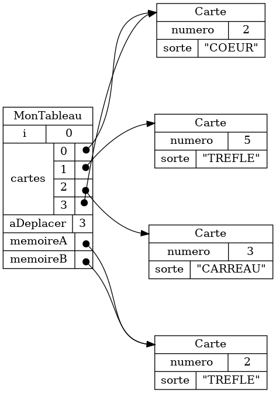

{}

Une fois les objets modélisés, la prochaine étape est de spécifier les
relations entre ces objets, c.-à-d. l'organisation de ces objets dans 
la mémoire du programme.

## Tableau de personnages 

On peut améliorer la modélisation d'un film présentée au chapitre précédent en ajoutant
la relation suivante&nbsp;:

* Un film contient des personnages


Voici des exemples de données se conformant à cette modélisation.

<table>

<tr>
<td>


</td>

<td>

```json
{}
```

</td>
</tr>

<tr>
<td>


</td>

<td>

```json
{}
```

</td>
</tr>


</table>

## Tableau de films

On peut améliorer la modélisation d'un personnage présentée au chapitre précédent en ajoutant
la relation suivante&nbsp;:

* Un personnage apparaît dans un ou plusieurs films


Voici des exemples de données se conformant à cette modélisation.

<table>

<tr>
<td>


</td>

<td>

```json
{}
```

</td>
</tr>

<tr>
<td>


</td>

<td>

```json
{}
```

</td>
</tr>


</table>


## Tableau de cartes

Les exemples de tableau de cartes sont plus pertinents à notre approche.
Considérer le diagramme de classe suivant.


Voici des exemples de tableau de cartes.

<table>

<tr>
<td>

</td>
<td>

</td>
</tr>

<tr>
<td>

</td>
<td>

</td>
</tr>

</table>


## Comprendre l'effet d'instructions typiques

Pour comprendre comment les cartes sont animées dans l'outil de validation, 
il est important de comprendre l'effet d'instructions typiques.

### Accéder à une valeur

<table>
<tr>
<th>Objets au départ</th>
<th>Instructions</th>
<th>Résultat</th>
</tr>

<tr>
<td>

</td>
<td>

```java
memoireA.getNumero();
memoireA.getSorte();
```

</td>
<td>

```java
5
"TREFLE"
```


</td>
</tr>
</table>

<table>
<tr>
<th>Objets au départ</th>
<th>Instructions</th>
<th>Résultat</th>
</tr>

<tr>
<td>

</td>
<td>

```java
cartes[2].getNumero();
cartes[2].getSorte();
```

</td>
<td>

```java
3
"CARREAU"
```


</td>
</tr>
</table>

<table>
<tr>
<th>Objets au départ</th>
<th>Instructions</th>
<th>Résultat</th>
</tr>

<tr>
<td>

</td>
<td>

```java
cartes[2].getNumero();
memoireB.getNumero();
```

</td>
<td>

```java
java.lang.NullPointerException
java.lang.NullPointerException
```


</td>
</tr>
</table>


### Déplacer un objet (déplacer une carte)


<table>
<tr>
<th>Objets au départ</th>
<th>Instruction</th>
<th>Résultat</th>
</tr>

<tr>
<td>

</td>
<td>

```java
memoireA = cartes[0];
cartes[0] = null;
```

</td>
<td>

</td>
</tr>
</table>

<table>
<tr>
<th>Objets au départ</th>
<th>Instruction</th>
<th>Résultat</th>
</tr>

<tr>
<td>

</td>
<td>

```java
cartes[2] = cartes[0];
cartes[0] = null;
```

</td>
<td>

</td>
</tr>
</table>

### Copier la référence à un objet


<table>
<tr>
<th>Objets au départ</th>
<th>Instruction</th>
<th>Résultat</th>
</tr>

<tr>
<td>

</td>
<td>

```java
memoireA = cartes[0];
```

</td>
<td>

</td>
</tr>

</table>

<table>
<tr>
<th>Objets au départ</th>
<th>Instruction</th>
<th>Résultat</th>
</tr>

<tr>
<td>

</td>
<td>

```java
cartes[2] = cartes[0];
```

</td>
<td>

</td>
</tr>
</table>


### Créer un nouvel objet (créer une nouvelle carte)


<table>
<tr>
<th>Objets au départ</th>
<th>Instruction</th>
<th>Résultat</th>
</tr>


<tr>
<td>

</td>
<td>

```java
memoireA = new Carte(2, "TREFLE");
```

</td>
<td>

</td>
</tr>

</table>


<table>
<tr>
<th>Objets au départ</th>
<th>Instruction</th>
<th>Résultat</th>
</tr>


<tr>
<td>

</td>
<td>

```java
memoireB = new Carte(5, "TREFLE");
```

</td>
<td>

</td>
</tr>

</table>


## Références multiples

Typiquement, on va copier une référence à un objet, plutôt que déplacer l'objet.

<table>
<tr>
<th>
Typique
</th>
<th>
Plus rare
</th>
</tr>

<tr>
<td>

```java
memoireA = cartes[0];
```

</td>
<td>

```java
memoireA = cartes[0];
cartes[0] = null;
```

</td>
</tr>
</table>

Le résultat est qu'on a des références multiples: plusieurs références vers le même objet.


Si on visualise du code typique avec les cartes, on va visualiser les références multiples en affichant plusieurs copies d'une carte.

<center>
<div style="max-width:300px;"/>
    {}
</div>
</center>


La visualisation est correcte, mais plus difficile à lire.


Autant que possible, on va expliquer les procédures en déplaçant les cartes,
c.-à-d. en évitant de créer des références multiples.  Cependant, il faut
garder en tête que le code typique contient très souvent des références
multiples.


