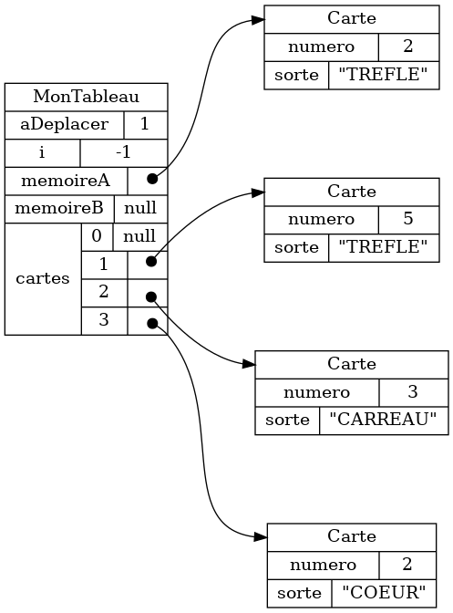
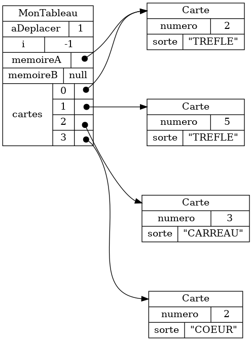
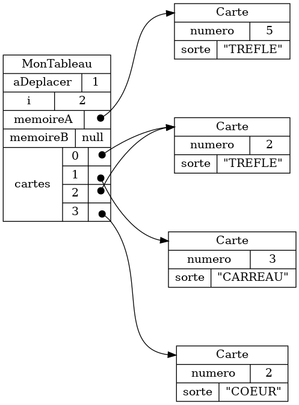

{}

## Tableau de cartes


### Exemple 1


### Exemple 2


## Tableau de films et de personnages


<br>


## Comprendre l'effet d'instructions typiques

### Accéder à une valeur


#### Example 1

<table>
<tr>
<th>Objets au départ</th>
<th>Instructions</th>
<th>Résultat</th>
</tr>

<tr>
<td>

</td>
<td>

```java
memoireA.getNumero();
memoireA.getSorte();
```

</td>
<td>

```java
5
"TREFLE"
```


</td>
</tr>
</table>

#### Example 2

<table>
<tr>
<th>Objets au départ</th>
<th>Instructions</th>
<th>Résultat</th>
</tr>

<tr>
<td>

</td>
<td>

```java
cartes[2].getNumero();
cartes[2].getSorte();
```

</td>
<td>

```java
3
"CARREAU"
```


</td>
</tr>
</table>

#### Example 3

<table>
<tr>
<th>Objets au départ</th>
<th>Instructions</th>
<th>Résultat</th>
</tr>

<tr>
<td>

</td>
<td>

```java
cartes[2].getNumero();
memoireB.getNumero();
```

</td>
<td>

```java
java.lang.NullPointerException
java.lang.NullPointerException
```


</td>
</tr>
</table>


### Déplacer un objet (déplacer une carte)


#### Exemple 1

<table>
<tr>
<th>Objets au départ</th>
<th>Instruction</th>
<th>Résultat</th>
</tr>

<tr>
<td>

</td>
<td>

```java
memoireA = cartes[0];
cartes[0] = null;
```

</td>
<td>

</td>
</tr>
</table>

#### Exemple 2

<table>
<tr>
<th>Objets au départ</th>
<th>Instruction</th>
<th>Résultat</th>
</tr>

<tr>
<td>

</td>
<td>

```java
cartes[2] = cartes[0];
cartes[0] = null;
```

</td>
<td>

</td>
</tr>
</table>

### Copier la référence à un objet


#### Exemple 1

<table>
<tr>
<th>Objets au départ</th>
<th>Instruction</th>
<th>Résultat</th>
</tr>

<tr>
<td>

</td>
<td>

```java
memoireA = cartes[0];
```

</td>
<td>

</td>
</tr>

</table>

#### Exemple 2

<table>
<tr>
<th>Objets au départ</th>
<th>Instruction</th>
<th>Résultat</th>
</tr>

<tr>
<td>

</td>
<td>

```java
cartes[2] = cartes[0];
```

</td>
<td>

</td>
</tr>
</table>


### Créer un nouvel objet (créer une nouvelle carte)


#### Exemple 1

<table>
<tr>
<th>Objets au départ</th>
<th>Instruction</th>
<th>Résultat</th>
</tr>


<tr>
<td>

</td>
<td>

```java
memoireA = new Carte(2, "TREFLE");
```

</td>
<td>

</td>
</tr>

</table>

#### Exemple 2

<table>
<tr>
<th>Objets au départ</th>
<th>Instruction</th>
<th>Résultat</th>
</tr>


<tr>
<td>

</td>
<td>

```java
memoireB = new Carte(5, "TREFLE");
```

</td>
<td>

</td>
</tr>

</table>


## Références multiples


Typiquement, on va copier une référence à un objet, plutôt que déplacer l'objet.

<table>
<tr>
<th>
Typique
</th>
<th>
Plus rare
</th>
</tr>

<tr>
<td>

```java
memoireA = cartes[0];
```

</td>
<td>

```java
memoireA = cartes[0];
cartes[0] = null;
```

</td>
</tr>
</table>

Le résultat est qu'on a des références multiples: plusieurs références vers le même objet.


Si on visualise du code typique avec les cartes, on va visualiser les références multiples en affichant plusieurs copies d'une carte.

<center>
<video autoplay loop mute controls="false" style="width:300px;">
    <source src="references_multiples.webm" type="video/mp4"/>
    <source src="references_multiples.mp4" type="video/webm"/>
</video>
</center>


La visualisation est correcte, mais plus difficile à lire.


Autant que possible, on va expliquer les procédures en déplaçant les cartes, 
c'est-à-dire
en évitant de créer des références multiples.
Cependant, il faut garder en tête que le code typique contient très souvent des références multiples.


