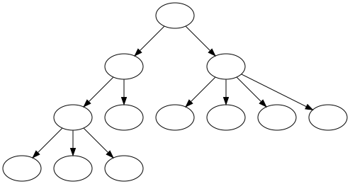
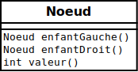

{}


## Arbre 


* Un arbre est une structure avec une racine et des branches:

    <center>
        
    </center>

    * NOTE: l'arbre est typiquement dessiné avec la racine en haut

* Chaque cercle ci-haut est appelé un noeud

* Chaque noeud peut avoir des enfants (indiqués par les flèches)
 
* Chaque noeud a exactement un parent (sauf la racine qui n'a aucun parent)

## Arbre binaire de recherche


* C'est un type d'arbre très utilisé en informatique:

    <center>
        
    </center>

* Chaque noeud contient un `Comparable` (p.ex. un `int`)

* Chaque noeud a au plus deux enfants

* L'enfant à gauche est toujours plus petit que le parent (et grand-parent, etc.)
    * p.ex.: `0 < 1` et `4<5`

* L'enfant à droite est toujours plus grand que le parent (et grand-parent, etc.)
    * p.ex.: `5>3` et `2>1`

## Arbre binaire en Java


* Il suffit de représenter un `Noeud`

    <center>
        
    </center>

* La définition de `Noeud` est récursive:
    * Qu'est-ce qu'un `Noeud`?
        * quelque chose qui contient deux noeuds!
            * `enfantGauche()` et `enfantDroit()`

* Par exemple, pour représenter l'arbre ci-haut:

```java
{}
```
