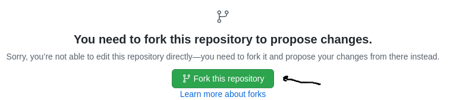
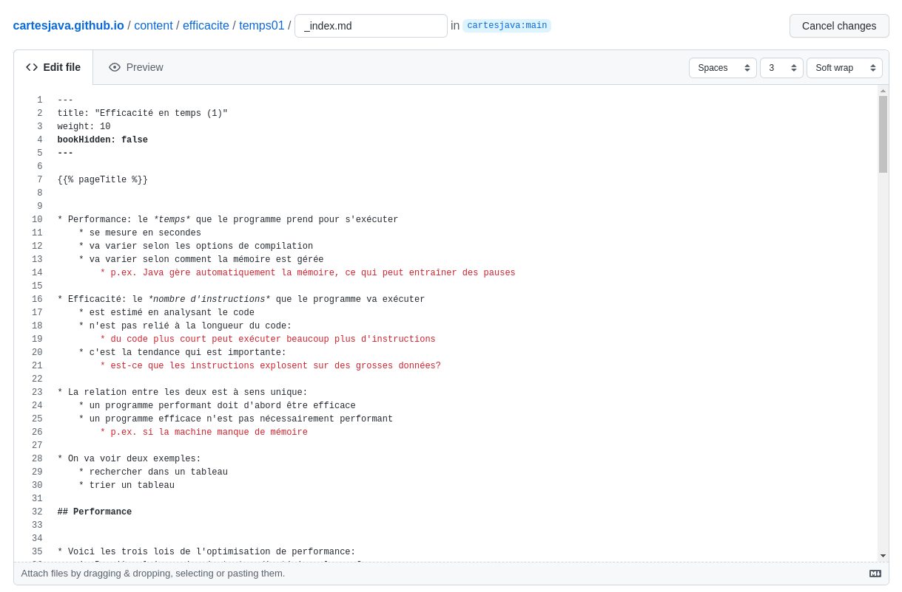
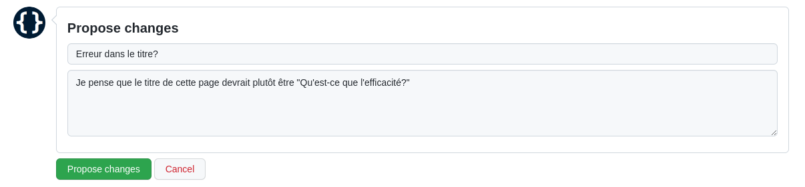
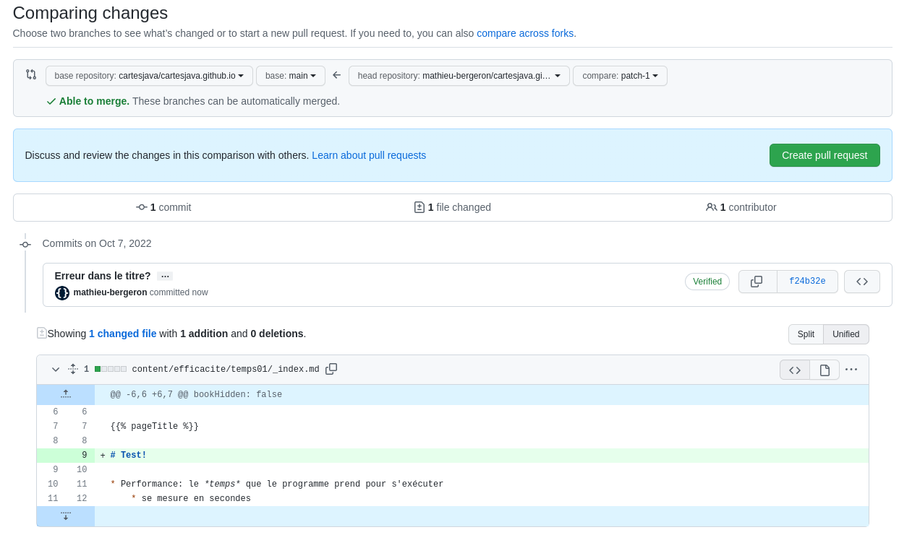

# Comment modifier ce manuel

## Obtenir les sources

Le dépôt source est ici: https://github.com/cartesjava/cartesjava.github.io

## Suggérer une modification

1. Cliquer sur *Suggérer une modification*

    

1. Se connecter à GitHub

1. La première fois uniquement

    * «forker» le dépôt

        

1. Modifier le source de la page directement dans votre naviguateur

    

1. Décrire votre modification (commentaire de commit)

    

1. Créer un «pull request» pour communiquer votre suggestion aux gestionnaires du dépôt d'origine

    

    
