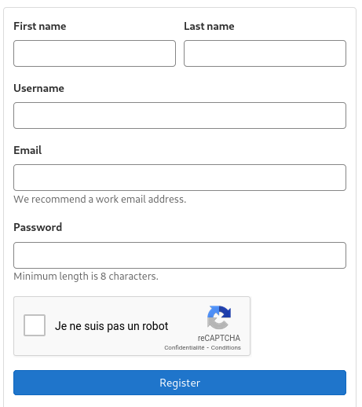
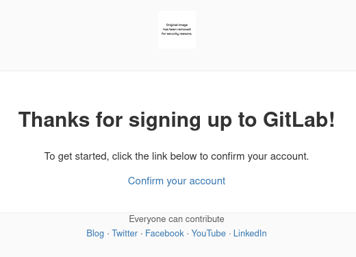

{}

1. Visiter [https://gitlab.com](https://gitlab.com)

    

    * Cliquer sur *Register*

1. Remplir le formulaire

    

    * Cliquer sur *Je ne suis pas un robot*

    * Cliquer sur *Register*

1. Attendre le courriel de confirmation

    

    * Cliquer sur le lien dans le courriel pour confirmer l'inscription
