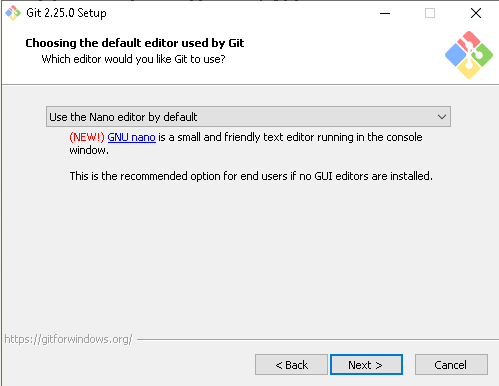

{}

Rappel&nbsp;: ne pas effectuer cette étape sur un Windows du Collège

 
 

* Visiter <a href="https://git-scm.com/download/win" target="_blank">https://git-scm.com/download/win</a>
* Télécharger et et exécuter `Git-2.37.2.2-64-bit.exe`
* Installer avec les options par défaut, **sauf**&nbsp;:
	* **Recommandé**&nbsp;: choisir `nano` comme éditeur plutôt que `vim`&nbsp;:
        

        
        

