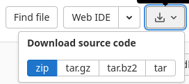
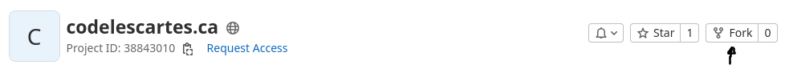
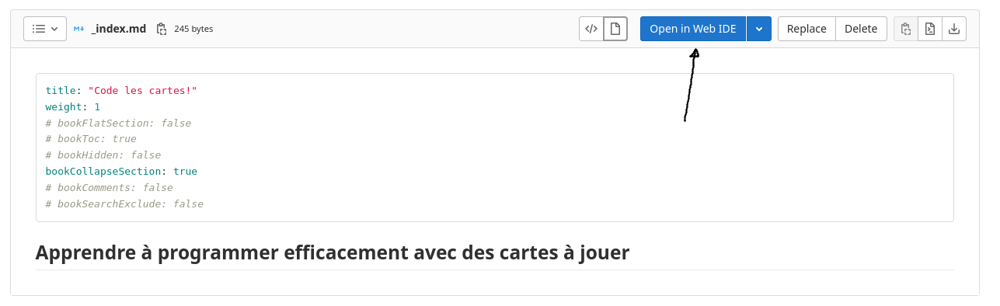
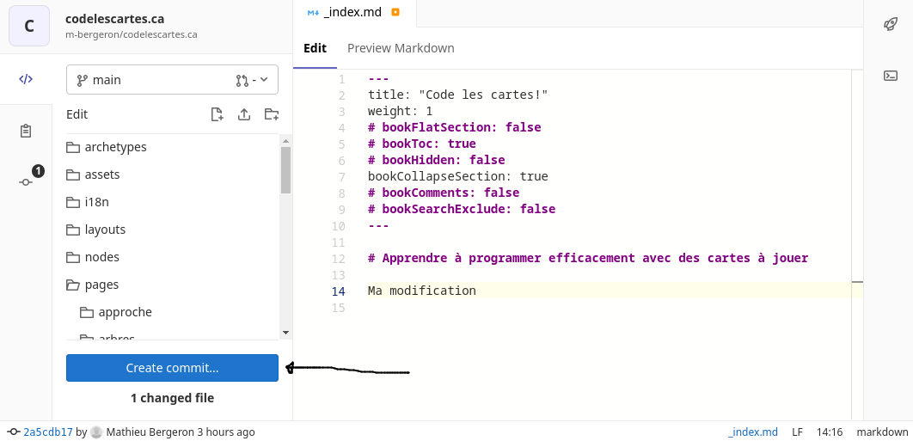
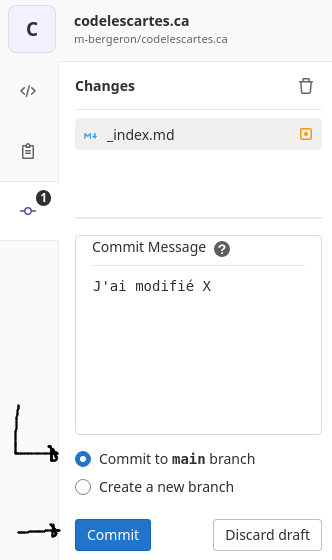
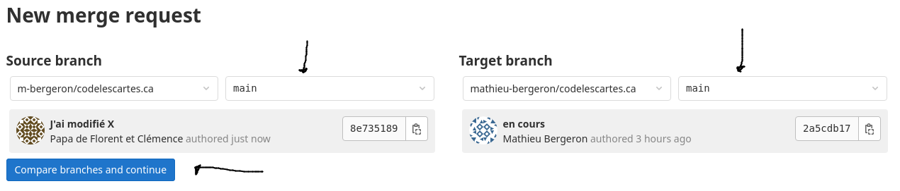
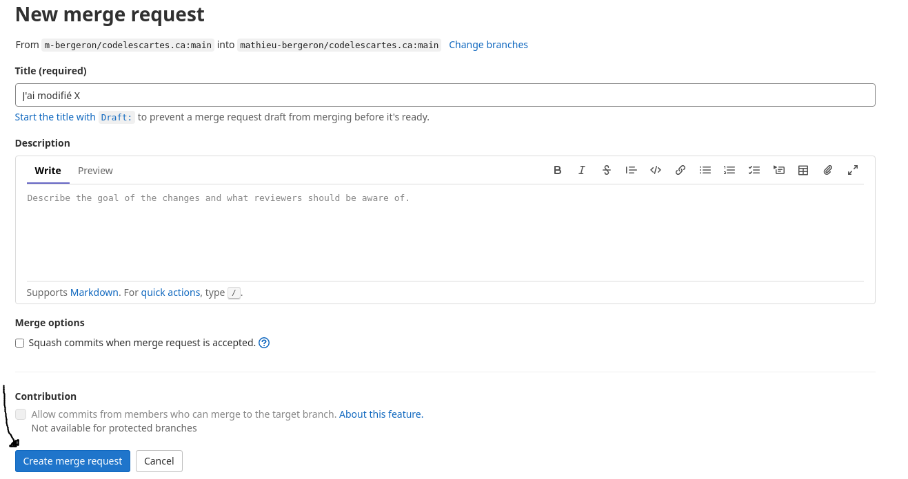

# Comment modifier ce manuel

## Obtenir les sources

Le source est ici: https://gitlab.com/mathieu-bergeron/codelescartes.ca

1. On peut télécharger les sources en `.zip`

    

1. Ou cloner le dépôt Git qui est public

    ```bash
    $ git clone https://gitlab.com/mathieu-bergeron/codelescartes.ca
        
    ```

## Suggérer une modification

1. Par courriel au <a href="mailto:mathieu.bergeron@cmontmorency.qc.ca">mathieu.bergeron@cmontmorency.qc.ca</a>

1. Via GitLab

    * «forker» le dépôt

        

    * dans votre dépôt, modifier directement les sources (sur GitLab ou en local après avoir cloné)

        
        

    * sauvegarder vos modifications (c-à-d faire un commit, suivi d'un push si vous travaillez en local) 

        * SVP utiliser la branche `main`

            

    * ouvrir un «merge request» pour que le mainteneur de https://gitlab.com/mathieu-bergeron/codelescartes.ca soit averti de vos suggestions

        * SVP choisir votre branche `main` comme branche source et la branche `main` de `mathieu-bergeron/codelescartes.ca` comme branche cible

            

            


